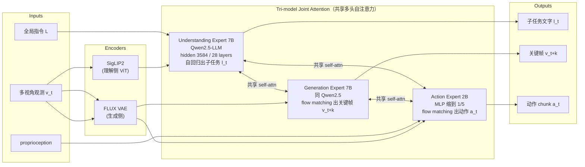
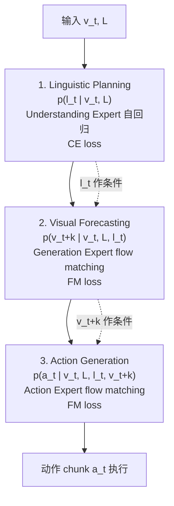
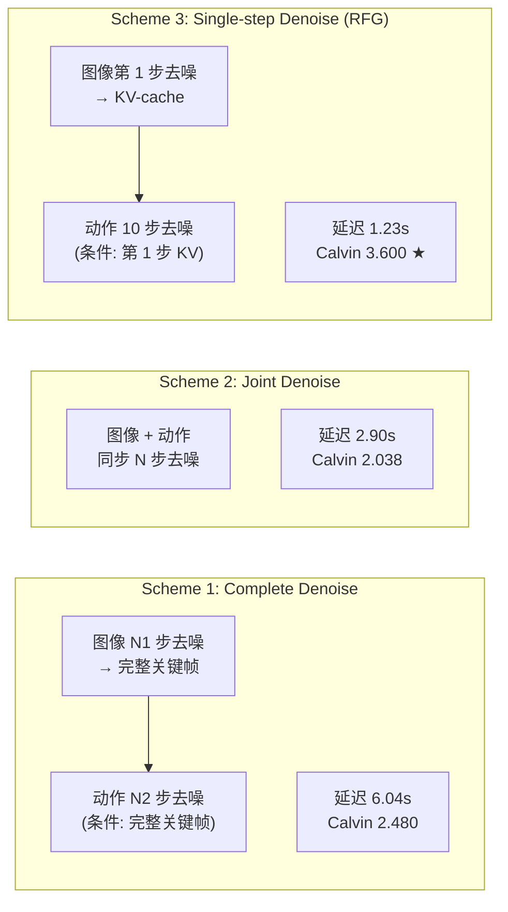
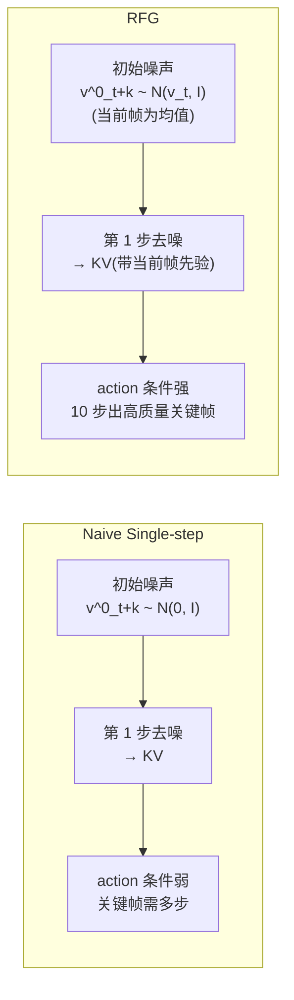
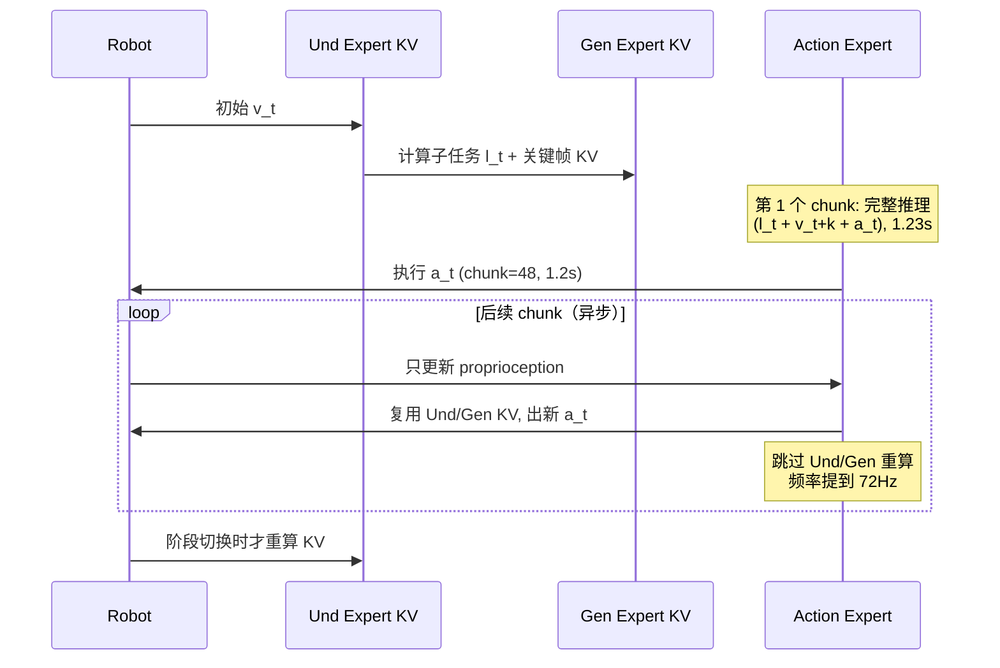

# BagelVLA 架构详解

> 配套 `card.json`。先用 Mermaid 把 MoT 三专家数据流、交错规划因果链、三种 dual denoise scheme 画清，再逐组件讲透。所有数字来自论文 Table（p18）或 Appendix D（p19）。

## 1. 总体数据流：MoT 三专家 + Interleaved Planning

**关键**：三个专家各自独立 Transformer 模块（保预训练先验不被互相稀释），只在多头自注意力层共享（MoT 耦合，cross-modal 融合）。这点和 Motus 一样，区别是 BagelVLA 的交错规划是**显式三步因果链**：l_t → v_{t+k} → a_t，后一步能 attend 前一步的隐状态。

## 2. Interleaved Planning：显式因果链分解

**因式分解**（p4 Sec 3.1）：`p(a_t, v_{t+k}, l_t | v_t, L) = p(l_t|v_t,L) · p(v_{t+k}|v_t,L,l_t) · p(a_t|v_t,L,l_t,v_{t+k})`。

**为什么显式分解**：长程任务的全局指令（如"按红→黄→蓝→绿顺序叠积木"）隐含一串子阶段。纯 VLA 黑盒映射无法显式分解，导致长程失败。BagelVLA 把它拆成三步，每步显式监督，且后一步能读到前一步的隐状态做条件。RoboTwin 上加文字规划从 54% 涨到 75%（+21%）。

## 3. Dual Flow Matching：三种 image-action 交互 scheme

**机制对比**（p6 Sec 3.3, p11 Table 4）：

| Scheme | 图像去噪 | 动作去噪 | 延迟 | Calvin ABC-D | 问题 |
|---|---|---|---|---|---|
| Complete | N1=50 步完 | N2=10 步 | 6.04s | 2.480 | OOD 中间态污染 action |
| Joint | N=同步 | N=同步 | 2.90s | 2.038 | 同上，且对齐难 |
| **Single-step (RFG)** | **1 步** | **10 步** | **1.23s** | **3.600** | 最快最准 ★ |

**反直觉发现**：Single-step 不仅最快还最准。原因是 Complete/Joint 在 OOD 测试（颜色变化）时，图像 FM 的中间去噪态会进入 OOD，污染 action；Single-step 只取第 1 步 KV，中间态不暴露给 action，鲁棒性更高。

## 4. Residual Flow Guidance（RFG）

**核心改动**（p7 Eq. 2 vs Eq. 3）：
- Naive: `v^0_{t+k} ~ N(0, I)`（纯高斯噪声）
- RFG: `v^0_{t+k} ~ N(v_t, I)`（以当前观测为均值的高斯）

**为什么有效**（p12 4.3.2）：当前帧注入让模型聚焦动态区域（机器人手臂运动）而非重建静态背景，所以 10 步就能生成高质量关键帧。action 学习收敛更快，延迟保持 1.23s 不变。Figure 5 可视化：RFG 在 10 步生成清晰未来帧，Naive 几乎是噪声。

## 5. 输入/输出契约

| 方向 | 名称 | 类型 | 说明 |
|---|---|---|---|
| 输入 | 多视角观测 v_t | image | Calvin 2 视角预测第 3；RoboTwin/真机 3 视角（主+左右腕）预测主视角 |
| 输入 | 全局指令 L | text | LLM expert 自回归上下文 |
| 输入 | proprioception | vector | Calvin 不用；RoboTwin/真机用，进 action expert |
| 输出 | 子任务 l_t | text | 理解专家自回归生成 |
| 输出 | 关键帧 v_{t+k} | image | 生成专家 flow matching 去噪 |
| 输出 | 动作 chunk a_t | continuous | Calvin chunk=10；RoboTwin chunk=16（horizon 48）；真机 chunk=24；双臂 14-DOF |

## 6. 数值 sense：模型到底多大

| 项 | 值 | 出处 |
|---|---|---|
| DiT 规格 | 三专家均 hidden=3584, 28 layers（同 Qwen2.5-LLM-7B）；Und/Gen intermediate=18944，Action intermediate=3584（缩到 1/5）| 论文 Table（p18）|
| 总参数 | ~16B（Und 7B + Gen 7B + Action 2B）| 论文 Table + 推算 |
| 分辨率 | 图像 256×256（VAE 输入）；多视角：Calvin 2→预测第 3，RoboTwin/真机 3→预测主 | 论文 Table（p18）+ Appendix D |
| VAE | FLUX VAE 编码图像（256×256→latent）；SigLIP2 作理解侧 visual encoder。两套独立 visual encoder | 论文 Sec 3.2.1 |
| 每帧 latent 维 | FLUX VAE 典型空间 8× 下采样，256×256→32×32，channel 16 → 每帧 ~1.6e4 维 | 推算（FLUX VAE 标准）|
| Chunk | Calvin chunk=10；RoboTwin chunk=16（every 3 steps, horizon 48）；真机 chunk=24。真机 40Hz@chunk=48 → 1.2s/chunk；异步 72Hz | 论文 Appendix D |
| 上下文 | 当前帧 v_t + 全局指令 L + 历史子任务（隐式自回归）；不显式长历史 KV | 论文 method |
| 动作 | 双臂 14-DOF；Calvin 不用 proprio，RoboTwin/真机用；flow matching 去噪 | 论文 Appendix D |
| 训练 | Stage1: 64×A800, batch~1600, 20k steps, lr 1e-5, FSDP, 只训 Und+Gen。Stage2: Calvin 8×A800 batch192 30k；RoboTwin 8×A800 batch128 60k；真机 32×A800 batch512 50k。image FM timestep LogitNormal(0,1)，action FM timestep Beta(1.5,1)。image 50 步/action 10 步；Single-step 1 步图像+10 步动作 | 论文 Appendix D + Table（p18）|

**Action expert 为什么缩到 2B**：原文"we reduce the intermediate size of the MLP to 1/5th of the original, resulting in 2B parameters. This compact size facilitates higher execution frequency during inference through KV-cache and asynchronous action generation"（p5）。高频跑（40Hz）+ KV-cache 异步是硬需求，所以 action expert 必须小。

## 7. Asynchronous Execution：40Hz → 72Hz

**训练 trick**（p8 Sec 3.5）：训练时随机用前一帧替换当前帧，让模型学会"在观测略滞后时也能出动作"。推理时 Und/Gen expert 的 KV 不每 chunk 更新，只更新 proprio 输入给 action expert。

**前提**：长程任务里子任务和关键帧不会每 chunk 都变，只在阶段切换时需要重新规划——这恰好是长程任务的结构。对高动态任务会掉点（论文未量化）。

## 8. 与其它 VLA/WAM 路线的根本区别

| 路线 | 规划方式 | 视觉前瞻 | 实时性 | 底座 |
|---|---|---|---|---|
| Cosmos Policy | 无显式 | 视频模型 fine-tune | 中 | 纯视频模型（缺 VLM）|
| VPP | 无显式 | 视频预测辅助 | 中 | VLM + 视频头 |
| DreamZero | 无显式 | joint video-action 实时 | 7Hz | Wan2.1 14B 单 DiT |
| Motus | UniDiffuser 五模式 | 联合生成 | 中 | Wan2.2 + Qwen3-VL MoT |
| **BagelVLA** | **显式文字→关键帧→动作三步** | **RFG 单步残差** | **1.23s/72Hz 异步** | **Bagel 统一 MoT** |

BagelVLA 的独特定位：**显式交错规划（长程强）+ RFG 把视觉前瞻压到可实时（1.23s）**，牺牲了 DreamZero 的端到端实时性，换来了长程任务的显式推理和语言 CoT 能力。
