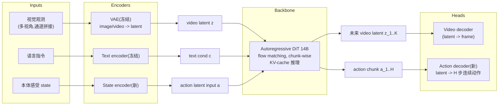
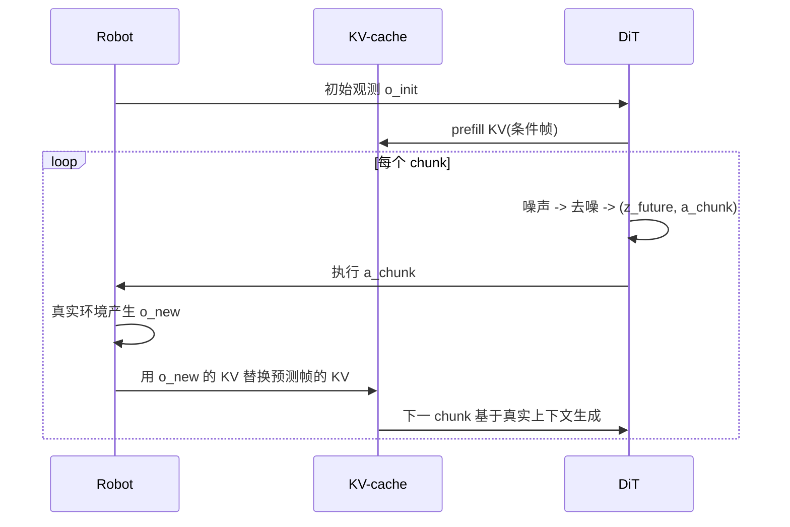

# DreamZero 架构详解

> 配套 `card.json`。下面先用一张 Mermaid 图把数据流和模块关系画清,再用文字把每个组件讲透。所有数字都来自论文(页码标注)。

## 1. 总体数据流(训练 vs 推理)

**训练时**:对每个 chunk k,把 clean context {(z_j, a_j)}_{j<k} 作为 teacher-forcing 上下文,对当前 chunk 的 noisy [z_t, a_t] 联合预测 velocity v=[z_1,a_1]-[z_0,a_0],用 flow-matching loss(p7 Eq.3)。

**推理时**:先 prefill context(初始观测)的 KV-cache,然后循环——对 noisy [z_0, a_0] 做 N 步去噪得到一个 chunk 的 video+action;执行动作的同时,把真实观测回填 KV-cache,继续下一个 chunk(p6, p8 Algorithm 2)。

## 2. 输入/输出契约

| 方向 | 名称 | 类型 | 说明 |
|---|---|---|---|
| 输入 | 视觉上下文 | image/video latent | 当前+历史观测;多视角在通道维拼成单帧,不改 backbone |
| 输入 | 语言指令 | text | 冻结的 text encoder |
| 输入 | 本体感受 | vector | 新增 state encoder |
| 输出 | 未来视频 latent | latent | 每 chunk K=2 latent 帧 |
| 输出 | 动作 chunk | continuous | AgiBot: H=48 @30Hz;DROID: H=24 @15Hz;每 chunk 1.6s |

最大上下文 = M=4 chunks × K=2 = 8 latent 帧 = 33 raw 帧 = 6.6 秒(p21)。

### 数值 sense:模型到底多大

| 项 | 值 | 出处 |
|---|---|---|
| DiT | 14B;hidden_dim=5120;40 layers × 40 heads;ffn=13824 | Wan2.1 HF model card |
| 分辨率 | 480P,面积固定,宽高比随输入(典型 832×480) | Wan2.1 |
| VAE | Wan 3D causal VAE;空间 8× 下采样(832×480→104×60);时间 4×(4 raw→1 latent);latent channel=16 | Wan2.1 vae.py + HF spec |
| 每帧 latent 维 | ~104×60×16 ≈ 10 万 | 推算 |
| Chunk | K=2 latent 帧 = 8 raw 帧;视频 5FPS → 1.6s;AgiBot H=48@30Hz,DROID H=24@15Hz | 论文 p21 |
| 上下文 | M=4 chunks = 8 latent = 33 raw = 6.6s | 论文 p21 |
| 动作 | 连续相对关节位置;AgiBot G1 双臂移动平台(DOF~十几到二十几),DROID Franka 7-DOF+夹爪 | 论文 p10-11 |
| 训练 | 100K steps × global batch 128(AgiBot 与 DROID 都是);全参数更新(LoRA 试过不行);冻结 text/image encoder + VAE | 论文 p11, p21 |

## 3. 为什么选 Autoregressive 而不是 Bidirectional

这是论文最有论证的一条架构选择(p7, Appendix B)。

**Bidirectional 的问题**:它要求固定长度序列,长程示教里语言指令通常只对应任务区间的一部分。如果不 subsample,模型生成的视频只覆盖任务片段,语言和视频错位;如果 subsample,在闭环里从任务中段(如 T=20)采样会扭曲原生帧率,video-action 对齐就崩了(Figure 13)。

**AR 的解法**:用视频上下文做条件而不是 subsample,既保住语言-视频对应,又保住原生帧率,语言/视频/动作三模态对齐才稳。副作用是 AR 推理因 KV-cache 比 BD 快 3-4x(p17)。

## 4. 关键机制:闭环 KV-cache 替换

这是 DreamZero 作为 WAM 比纯视频生成器强的地方(p6, p8):

**为什么重要**:纯 AR 视频生成会 compounding error(越生成越偏)。闭环里每 chunk 用 GT 观测纠正 KV-cache,误差不累积——这是它能做实时控制的根基,也是它配叫 "policy" 而不是 "video generator" 的原因。

## 5. 推理加速栈(38× 的拆解)

| 层级 | 优化 | H100 | GB200 |
|---|---|---|---|
| baseline | naive | 1× | 1.1× |
| 系统 | CFG 双卡并行 | 1.9× | 1.8× |
| 系统 | + DiT caching(速度相似时复用) | 5.5× | 5.4× |
| 实现 | + torch.compile + CUDA Graphs | 8.9× | 10.9× |
| 实现 | + kernel/scheduler(cuDNN, GPU 化) | 9.6× | 14.8× |
| 实现 | + NVFP4 量化 | — | 16.6× |
| 模型 | + DreamZero-Flash(解耦 schedule) | — | **38×** |

最终:5.7s → 150ms → 7Hz(p9-p10 Table 1)。

注意:DiT caching 和 NVFP4 不是数学等价,论文报告 minimal quality loss 但未给完整对照(我们读出的局限)。

## 6. DreamZero-Flash 的核心 trick

标准 DreamZero:video 和 action 共享 timestep t~U(0,1)。few-step 推理时 video 还很噪,但模型训练时学的是"两者同噪声级别",于是 action 从噪声 video 读条件 → 不准。

Flash:训练时把 video 的 timestep 偏向高噪声(t_vid = 1 - η, η~Beta(7,1),E[t_vid]=0.125),action 仍 uniform。让模型专门学"video 还很脏时也能输出干净 action",正好匹配 1-step 推理的真实条件(p9 Figure 5)。

结果(p17 Table 3):1 步推理从 52% → 74%,只比 4 步 baseline(83%)低 9 个点。这是论文里性价比最高的一个工程创新。

## 7. 与其它世界模型路线的根本区别(Appendix A)

| 路线 | 建模对象 | 部署 |
|---|---|---|
| Latent world model(JEPA2/Dreamer) | p(s_{t+1}\|s_t,a_t) 前向动力学 | 需要 goal-conditioned planning 或搜索 |
| 3D 点云 world model(PointWorld) | 3D 点流 conditioned on action | 需要 MPPI 等显式优化 |
| **WAM(DreamZero)** | **p(o,a\|history)** 联合 | **直接出动作轨迹,无 test-time 优化** |

这是 WAM 能做 7Hz 实时、search-based 路线做不到的根本原因(p20)。
