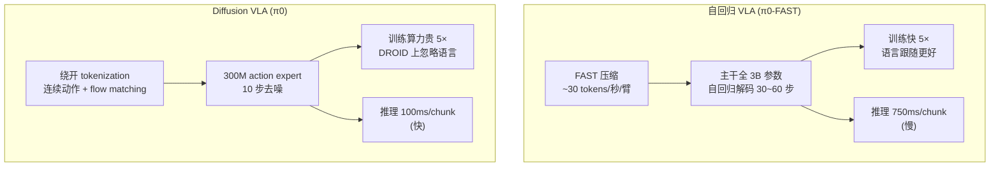

# FAST 架构详解

> 配套 `card.json`。FAST 是一个**动作编解码器**,而非新的神经网络——它外挂在自回归 VLA 主干上,决定"连续动作 chunk 怎么进出 token 序列"。下面先用 Mermaid 把编解码流程和与主干的接口画清,再用文字把每一步讲透。所有数字来自论文(页码标注)。

## 1. FAST 在系统里的位置(训练 vs 推理)

```mermaid
flowchart LR
  subgraph Inputs["VLA 输入侧(主干)"]
    IMG["图像 224×224<br/>(3rd + wrist)"]
    LANG["语言指令"]
    PROP["proprio state"]
  end

  subgraph VLM["VLM 主干<br/>PaliGemma-3B (π0) / Prismatic-7B (OpenVLA)"]
    ENC["视觉编码器<br/>每图独立编码后 token 拼接"]
    LLM["LLM token 序列<br/>视觉 token ⊕ 语言 token ⊕ proprio bin token"]
  end

  subgraph FAST["FAST 动作侧(本文核心)"]
    NORM["① quantile 归一化<br/>→ [-1,1]"]
    DCT["② 离散余弦变换<br/>(每维独立)"]
    QUANT["③ scale-and-round<br/>γ=10, 得稀疏系数"]
    FLAT["④ 低频优先 flatten"]
    BPE["⑤ BPE 压缩<br/>词表 1024"]
  end

  subgraph Out["输出"]
    ATOK["动作 token 序列<br/>~30 tokens/秒/臂"]
    ACT["detokenize<br/>→ 1s 连续动作 chunk"]
  end

  IMG --> ENC
  LANG --> LLM
  PROP -->|256-bin 离散化| LLM
  ENC --> LLM
  LLM -->|next-token prediction| ATOK
  ATOK -->|detokenize (BPE 逆→unflatten→inverse DCT→denormalize)| ACT

  NORM --> DCT --> QUANT --> FLAT --> BPE
  BPE -.->|训练时:覆盖 LLM 词表最少用 token| ATOK
```

**训练时**:对每个 1 秒 action chunk,FAST encoder 一次性把它编码成 n 个动作 token,作为 next-token loss 的 target;主干全参数 fine-tune,把"图像+语言+proprio → 动作 token"学下来。动作 token 直接覆盖 LLM 词表里使用频率最低的那些槽位(RT-2/OpenVLA 标准做法)。

**推理时**:主干从 `<bos_action>` 起逐 token 贪心解码(双臂任务加温度 β=0.7 帮助跳出 home position),吐出 n 个动作 token 后,FAST decoder 精确逆过程还原成 1 秒连续动作 chunk,**开环执行整段 chunk**——chunk 内不接新观测。

## 2. 输入/输出契约

| 方向 | 名称 | 类型 | 说明 |
|---|---|---|---|
| 输入 | 图像 | image 224×224 | 1 张第三视角 + 每臂 1 张腕部;各自过视觉编码器后 token 拼接 |
| 输入 | 语言指令 | text | LLM 自带 tokenizer 编码 |
| 输入 | proprio | vector | 256-bin 离散化成整数串,当文本 token(输入侧,不进 loss) |
| 输出 | 动作 token 序列 | discrete | FAST 压缩后 ~30 tokens/秒/臂,覆盖 1 秒 chunk |
| 输出 | 动作 chunk | continuous | detokenize 后的 1 秒动作,维度=|A|,步数=控制频率 |

**chunk 跨度**:固定 1 秒;步数随频率变(Bridge 5 步、DROID 15 步、Bussing 20 步、Shirt Fold 50 步)。
**控制频率**:5~50 Hz 覆盖。
**推理延迟**:π0-FAST ~750ms/chunk(diffusion π0 ~100ms)。

## 3. 核心诊断:为什么 binning 在高频失败

这是 FAST 存在的理由(p3, Figure 3)。

**binning 的机制**:每个 action 的每个维度、每个时间步,独立分到 256 个 bin 之一。1 秒 50Hz 双臂 14 维 = 700 个 token。

**为什么崩**:autoregressive 的学习信号 = T_i 给定 T_{1:i-1} 的边际信息量。高频信号相邻 token 高度相关(50Hz 下相邻动作差值极小),边际信息趋零。模型只需"复制上一个 token"就能拿到极低 loss,陷入 trivial local optimum,真正的细微变化学不到。toy 实验(过 4 点的三次样条,采样率 25→800)干净证明:数据分布不变、模型容量不变,只换 tokenization,binning 误差随采样率陡升,FAST 全程平稳。

**关键洞察**:问题在 tokenization 让学习信号消失,与模型容量无关。所以解法是先压缩,而非堆参数。

## 4. FAST 五步流水线(p4-5, Algorithm 1)

### ① Quantile 归一化
把每个 action 维度的训练数据 1st/99th 分位映射到 [-1, 1]。用分位数而非 min/max 是为了抗离群点(大机器人数据集偶有异常动作)。这步还顺带让跨本体数据集(不同动作 scale)能统一 tokenization。

### ② 离散余弦变换 (DCT)
对每个 action 维度独立做 DCT,把时域信号转到频域。DCT 把信号表示成一组余弦基的加权和:低频系数承载整体形状,高频系数承载细节。因为机器人动作通常平滑,DCT 后大部分能量集中在少数低频系数,高频系数权重极小——这正是 JPEG 压缩同款性质。

### ③ Scale-and-round 量化
把 DCT 系数乘以 γ(默认 10)后四舍五入。高频小系数被量化成 0,得到稀疏整数矩阵。γ 是唯一控制"压缩↔重建"权衡的超参:γ 大压缩狠失真多,γ 小反之。论文在 6 数据集上扫过(Figure 12),证明 FAST 在宽 γ 范围内都稳。

### ④ 低频优先 flatten
把 |A|×H 的稀疏矩阵按"所有维的最低频系数先排,再所有维的次低频..."的顺序展平成 1D 整数序列。这步选择很重要:autoregressive 模型先预测决定整体形状的低频系数,后续高频系数条件充足时再预测,rollout 更稳。行优先(先把单维所有频率排完)会让模型在还没建立全局形状时就预测细节,不稳。

### ⑤ BPE 无损压缩
对 flatten 后的整数序列训一个 byte-pair encoding 词表(默认 1024),把频繁共现的系数组合 merge 成单 token。BPE 是 lossless、可逆,且产出的词表能直接并入 LLM 既有词表。这步把稀疏的 0 全压掉,把高频共现模式(如某维低频系数常组合出现)压成单 token。

**整个流水线可逆**:detokenize 时按 BPE 逆→unflatten→inverse DCT→denormalize,精确还原连续动作。

## 5. 数值 sense:这个 tokenizer 到底多大

| 项 | 值 | 出处 |
|---|---|---|
| BPE 词表大小 | 1024(单数据集与 FAST+ 通用版都用) | 论文 V-B |
| 动作 token 表示 | LLM 词表里的整数 ID(覆盖最少用的槽位) | 论文 VI-A |
| 压缩比 vs naive | Bridge 1.75× / DROID 3.6× / Bussing 5.0× / Shirt Fold 13.2× | 论文 Table I (p7) |
| tokens/chunk | FAST 稳定 ~30/秒/臂(双臂 ~60),与频率无关 | 论文 Table I 注释 |
| 主干 | π0 = PaliGemma-3B;OpenVLA = Prismatic-7B | 论文 VI-A |
| 图像 | 224×224,每张独立编码后 token 拼接 | 论文 Appendix C |
| action chunk | 1 秒;步数=频率;维度 |A| 从 7(单臂)到 40(humanoid H1) | 论文 Table III |
| rounding scale γ | 10(所有单数据集实验同值) | 论文 V-B |
| 训练算力 | π0-FAST 用 5× fewer GPU hours 比 diffusion π0;DROID: 240k iter × batch 256, 3 epoch, 8×H100 约 4 天 | 论文 VI-F, Appendix D |
| 学习率/优化器 | lr 5e-5, AdamW (b1=0.9,b2=0.95), 无 weight decay, grad clip 1, EMA 0.999 | 论文 Appendix C |
| 推理延迟 | π0-FAST ~750ms/chunk;diffusion π0 ~100ms/chunk | 论文 VI-E |

**给听众的标尺**:1024 词表、γ=10、~30 tokens/秒/臂、1 秒 chunk、3B 主干、8×H100 训 4 天(DROID)。压缩比是 FAST 最该记住的数字——它随频率涨,binning 是线性涨、FAST 是常数。

## 6. FAST+ 通用 tokenizer:把"每数据集一训"变"即插即用"

唯一需要训练的组件是 BPE 词表。作者在 1M 条 1 秒跨本体 action chunks 上预训练一个通用词表(单臂/双臂/移动/dex 手/humanoid/nav,joint/EEF/cam-frame,5~60Hz),发布成 HuggingFace AutoProcessor。

```python
from transformers import AutoProcessor
tokenizer = AutoProcessor.from_pretrained(
    "physical-intelligence/fast", trust_remote_code=True)
tokens = tokenizer(action_chunk)
```

**为什么通用化成立**:FAST 压缩比与频率无关、稳定 ~30 tokens/秒/臂,说明它逼近了动作信号的内在复杂度,不依赖具体本体。实测 FAST+ 在所有未参与训练的数据集上都 ≥2× 压缩(Figure 8),policy 训练性能追平数据集专属 FAST(Figure 6)。

## 7. 与 diffusion VLA 的根本 trade-off



**关键结论(p10-11)**:在性能和算力效率上,π0-FAST 匹敌甚至超过 diffusion π0;在推理速度上,diffusion π0 仍快 7.5×。两条路线的 trade-off 被清晰量化——论文不声称某条绝对更优,只说"自回归路线重新有竞争力了"。

## 8. 与其它 tokenization 路线的对比

| 路线 | 机制 | 高频表现 | 训练成本 |
|---|---|---|---|
| naive binning (RT-2/OpenVLA) | per-dim per-step 256 bin | 崩(700 tokens, 0 学习信号) | 0 |
| FSQ / VQ-VAE | 学习式 vector quantization | 比 binning 好,输 FAST | 高(要训 encoder-decoder) |
| **FAST** | DCT + scale-round + BPE | 最稳,高保真下优势大 | 极低(只训 BPE 词表) |
| semantic reps (keypoints/lang) | 语义级动作表示 | 样本高效但需 hand-designed 控制器 | 中 |

**FAST 的位置**:它不是"压得最狠"的(VQ 在低 fidelity 区更狠),是"高保真下仍能压且几乎免训练"的——这决定了它适合精细控制场景(Figure 12)。
