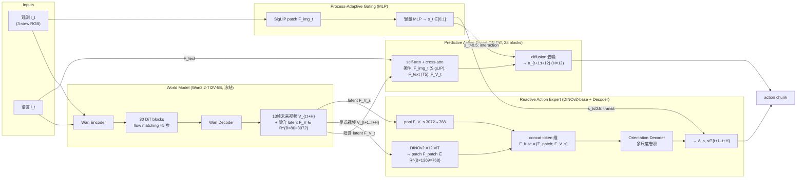
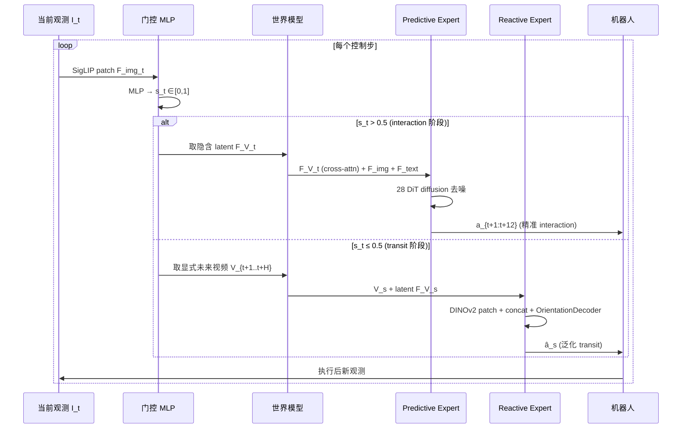
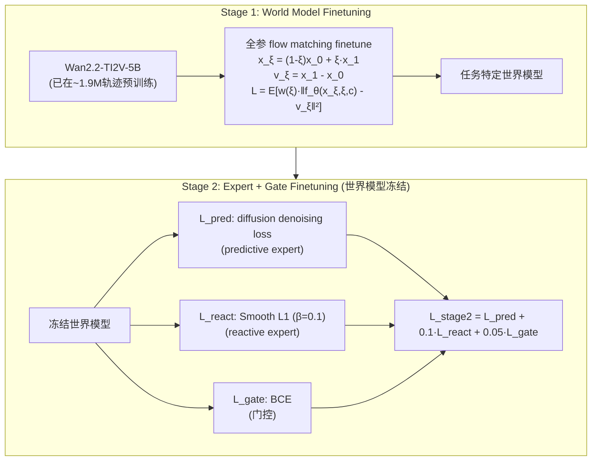

# HarmoWAM 架构详解

> 配套 `card.json`。先用 Mermaid 把数据流和门控路由画清,再用文字把每个组件讲透。所有数字来自论文(页码标注)。

## 1. 总体数据流(世界模型 → 双 expert → 门控路由)

**关键点**:双 expert 不并行跑,由门控二选一。Predictive 吃隐含 latent(diffusion 精准),Reactive 吃显式未来视频(IDM 泛化)。两者共享同一世界模型条件,物理先验不割裂(p5 Figure 2)。

## 2. 输入/输出契约

| 方向 | 名称 | 类型 | 说明 |
|---|---|---|---|
| 输入 | 视觉观测 | image | 3 视角 RGB,RealSense 640×480;世界模型用其中一路 |
| 输入 | 语言指令 | text | T5 编码,cross-attn 注入 |
| 输入 | 本体感受 | vector | 单臂 7-DoF / 双臂 14-DoF |
| 输出 | 未来视频 | video | 13 帧 256×320,5 步去噪 |
| 输出 | 动作 chunk | continuous | H=12 步,单臂 R^7 / 双臂 R^14,48Hz |

### 数值 sense:模型到底多大

| 项 | 值 | 出处 |
|---|---|---|
| DiT 世界模型 | Wan2.2-TI2V-5B,5B(MoE);hidden 3072 | Wan2.2 HF model card |
| DiT predictive | 1B,28 Transformer blocks,diffusion | 论文 p5 |
| 分辨率 | 世界模型 256×320(VAE→16×20);摄像头 640×480 | 论文 p4, p15 |
| VAE | Wan2.2-VAE:空间 16×、时间 4×、latent channel 16 | Wan2.2 HF(压缩比 16×16×4) |
| 每帧 latent 维 | 16×20×16≈5120;patch(2×2)→80 token×3072 | 论文显式 R^{B×80×3072}(p5) |
| Chunk | 13 帧未来视频;action H=12;去噪 5 步 | 论文 p4-5, p23 Table 9 |
| 上下文 | 当前 1 帧+13 帧未来;无长历史 | 论文设计 |
| 动作 | 连续相对位姿;单臂 7-DoF/双臂 14-DoF;H=12,48Hz | 论文 p3, p4 |
| 训练 | 8×H20;两阶段;λ_react=0.1, λ_gate=0.05;门控 96.95% | 论文 p16-17, p19 |

## 3. 为什么是双 expert 而不是单 expert

这是 HarmoWAM 最核心的设计选择,由 motivation 实验(Table 1)驱动(p4):

**Imagine-then-Execute 的 IDM 路线**:transit 在 OOD 几乎满分(10/10),但 interaction 掉到 55%——因为 IDM 只从像素反推动作,缺接触级精度,夹爪偏移、提前开合。

**Joint Modeling 路线**:ID interaction 能 90%+,但 OOD transit 掉到 32%——action 被 SFT 分布锁死,即使初始化到目标附近 interaction 还能 95%,说明瓶颈是探索不是精度。

**HarmoWAM 的解法**:不折中,分工。让世界模型的隐含 latent(时序物理先验)喂 predictive expert 做 interaction,显式未来视频(泛化视觉先验)喂 reactive expert 做 transit。Figure 3 attention map 给机理证据:predictive attend 物体(接触级),reactive attend 夹爪+周围(空间级)。Figure 5c 消融:去掉 latent,predictive ID 从 95% 掉到 62%,证明隐含 latent 是精度的关键。

## 4. Process-Adaptive Gating:阶段感知硬路由

**门控训练监督**(p6, p19 Appendix D.3):用 keyframe pipeline 自动标 y。夹爪状态变化(open↔close,grasping/releasing)或任务相关末端高度阈值(insertion/pouring/placing)作为 key event;前后各 20 帧窗口标 y=1(interaction),其余 y=0(transit);双臂任一满足即标 interaction。BCE loss,λ_gate=0.05。离线准确率 96.95%(1637 测试帧对)。

**为什么硬路由 > 平均**(Figure 5b):Averaging 在 position OOD 掉 46%,Keyframe-Averaging 掉 31%,门控几乎不掉。两个 expert 在错误阶段发力会互相干扰——transit 阶段让 predictive 发力会过度精细导致到不了目标,interaction 阶段让 reactive 发力会精度不足。门控让各自在最擅长阶段不被对方稀释。

## 5. 两阶段训练流程

Stage1 让世界模型先学通用机器人动态再任务化;Stage2 冻结它保稳定,expert 在固定条件下学专门化(p6, p16-17)。λ 权重让 predictive 的 diffusion loss 主导(它管最难的 interaction),reactive 和 gate 作辅助。

## 6. 关键设计权衡

| 设计 | 选择 | 理由 |
|---|---|---|
| 单 vs 双 expert | 双 expert | Table 1 证明单 expert 难同时拿泛化和精度 |
| 路由方式 | 门控硬路由 | Figure 5b 证明平均互相干扰 |
| 条件形式 | 隐含 latent + 显式视频 | Figure 5c 证明 latent 是精度关键,视频是泛化关键 |
| 视频生成步数 | 5 步 | Table 9 边际递减,5 步是甜点 |
| 世界模型冻结 | stage2 冻结 | 保稳定,避免 expert 训练破坏世界模型 |
| horizon | 固定 13 帧 | 自承限制,未来探索自适应 horizon |

## 7. 与 DreamZero 的根本区别

| 维度 | DreamZero | HarmoWAM |
|---|---|---|
| expert 数 | 1(联合 video+action) | 2(predictive + reactive) |
| 上下文 | 6.6s KV-cache 长历史 | 当前帧 + 13 帧预测,无长历史 |
| 路由 | 无(单一模型) | 过程自适应门控硬路由 |
| 核心机制 | 闭环 KV-cache 替换消误差 | 双 expert 分工 + 门控协调 |
| 适用场景 | 长程连续控制 | transit/interaction 阶段分明的任务 |

两者解决 WAM 不同维度:DreamZero 解实时闭环和误差累积,HarmoWAM 解泛化-精度 trade-off。互补而非替代。
