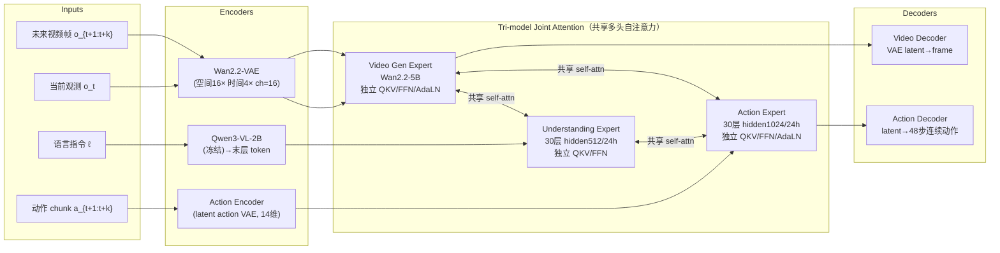
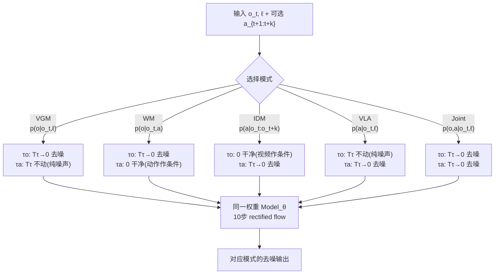
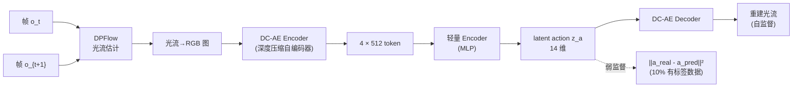
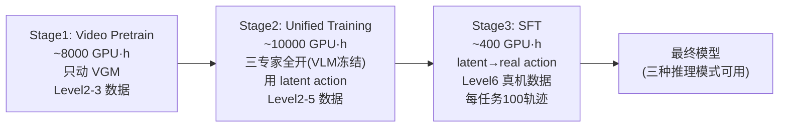

# Motus 架构详解

> 配套 `card.json`。先用 Mermaid 把三专家 MoT 数据流和五模式切换画清，再逐组件讲透。所有数字都来自论文 Table 11/13 或 Wan2.2 公开 model card（标注出处）。

## 1. 总体数据流：Mixture-of-Transformers 三专家

**关键**：三个专家**各自保留独立 Transformer 模块**（独立 QKV/FFN/AdaLN），只在多头自注意力层做共享拼接。这是 Mixture-of-Transformers（MoT）的核心——不拼 token，而是拼 attention。这样：
- 各专家的预训练先验不被互相稀释（VLM 不被 action 训练破坏，VGM 不被理解任务带偏）。
- 共享 self-attention 让三专家能互相读到对方隐状态做条件，实现跨模态融合。

## 2. UniDiffuser 式调度：一个权重切换五模式

**机制**（p13-14 Algorithm 2-6）：rectified flow 插值路径 `x_τ = (1-τ)x_0 + τ·ε`。τ=0 是干净、τ=Tτ 是纯噪声。
- 把某模态固定在 τ=0 → **作条件**（不生成）
- 固定在 τ=Tτ → **只生成噪声，不推理**（输出无意义）
- 从 Tτ 降到 0 → **要去噪生成**

五种模式 = (τo 起止, τa 起止) 的不同组合。训练时五种数据混合统一训，推理时按目标固定 (τo, τa) 起止即可切换。这是 UniDiffuser"一个模型表达边际/条件/联合分布"思想在机器人五模式上的落地。

## 3. 输入/输出契约

| 方向 | 名称 | 类型 | 说明 |
|---|---|---|---|
| 输入 | 条件帧 o_t | video latent | Wan2.2-VAE 编码，五模式共用 |
| 输入 | 语言 ℓ | text | VLM 理解专家处理，cross-expert attention 注入 |
| 输入 | 未来视频 o_{t+1:t+k} | video latent | 8 帧 @5Hz；部分模式作条件，部分作输出 |
| 输入 | 动作 chunk | latent/continuous | 48 步 @30Hz；Stage2 是 14 维 latent action，Stage3 是真实动作 |
| 输出 | 未来视频 latent | latent | VGM/WM/Joint 产出 |
| 输出 | 动作 chunk | continuous | VLA/IDM/Joint 产出；RoboTwin chunk=16，真机 chunk=48 |

## 4. 数值 sense：模型到底多大

| 项 | 值 | 出处 |
|---|---|---|
| DiT 规格 | Action Expert hidden=1024, 30 layers, 24 heads, GELU；Und. projection hidden=512, 30 layers, 24 heads；VGM=Wan2.2-5B dense DiT | 论文 Table 11 |
| 总参数 | ~8B（VGM 5.00B + VLM 2.13B + Action 641.5M + Und. 253.5M）| 论文 Table 11 |
| 分辨率 | Wan2.2 原生 720P@24fps；Motus 训练视频降到 5Hz、每 chunk 8 帧 | Wan2.2 HF card / 论文 Table 11 |
| VAE | Wan2.2-VAE：空间 16× 下采样，时间 4×（压缩比 T×H×W=4×16×16），latent channel=16；加 patchification 后总 4×32×32 | Wan2.2 HF card |
| 每帧 latent 维 | Wan2.2-VAE 单帧通道 16；720P 输入下空间维 ~40×22 → 每帧 ~1.4e4 维 | 推算 |
| Chunk | Video 8 帧 @5Hz = 1.6s；Action 48 步 @30Hz = 1.6s | 论文 Table 11 |
| 上下文 | 仅当前帧 o_t（不显式长历史）| 论文 method |
| 动作 | Stage2: 14 维 latent action；Stage3: 真机动作（AC-One/Agilex 双臂）；RoboTwin chunk=16，真机 chunk=48 | 论文 Table 11 |
| 训练 | Stage1 ~8000 GPU·h；Stage2 ~10000 GPU·h；Stage3 ~400 GPU·h；总 ~18400 GPU·h。batch 256, AdamW, lr 8e-5→5e-5→1~5e-5 | 论文 Table 13 |
| 推理 | 10 步 flow matching，Logit Normal 采样 | 论文 Table 11 |

**注意 Wan2.2-VAE vs Wan2.1-VAE 的差异**：Wan2.1（DreamZero 用的）是空间 8× 时间 4×，channel 16；Wan2.2 是空间 16× 时间 4×，channel 16。Wan2.2 空间压缩更狠（16× vs 8×），所以单帧 latent 维更小，但 patchification 层会把 token 数再降。Motus 选 Wan2.2-5B 而非 Wan2.1-14B，主要为了"accessibility and ease of use"（论文 p5 原话），用更小底座换取易部署。

## 5. Latent Action VAE：光流 → 14 维跨本体动作

**为什么用光流不用 RGB**（p5）：
- 光流是"像素级位移"，天然剥掉外观只留运动 → 跨本体通用（人/机器人/不同构型都产生光流）。
- RGB latent action（LAPA 那套）会把任务无关外观编进 latent，干扰下游 action 学习。

**14 维的对齐技巧**：DC-AE 编码出 4×512 token，轻量 encoder 压到 14 维，"roughly matching typical robot action spaces"——让 latent action 的尺度直接对齐真实机器人动作，这样 Stage3 SFT 时 latent→real 的迁移跳跃最小。

**训练配比**：90% 无标签数据自监督重建光流 + 10% 有标签（task-agnostic Curobo 数据 + 真机示教）弱监督对齐。loss = `L_recon + λa·||a_real - a_pred||² + β·L_KL`，λa=1.0, β=1e-6（Table 11）。

## 6. Action-Dense Video-Sparse：为什么把视频率压到 1/6

action chunking 下默认 video 帧数 >> action 步数（8 video 帧 vs 48 action 步，看似已经平衡，但 video 每帧 latent 是 ~1.4e4 维，action 每步是 14 维，**token 维度悬殊**导致 attention 被 video 主导）。

论文的解法（p4 Figure 2）：把视频采样率压成动作率的 1/6（video 5Hz / action 30Hz），让两类 token 在 attention 里数量平衡。这同时解决了三个问题：
1. 训练推理效率低
2. video 帧冗余
3. Tri-model Joint Attention 里 video token 淹没 action token

## 7. 三阶段渐进训练

**渐进逻辑**：
- Stage1 先把 VGM 在多机器人+人类视频上适应，让视频生成模型"见过"机器人动作的视觉动态。
- Stage2 关键阶段：用 latent action（光流编码）让 action 专家在 Level2-5 大规模数据上预训练——这是 action 专家首次能从无动作标签视频学。
- Stage3 用 Level6 真机小数据（2000 段）把 latent action 换成真实动作，完成本体适配。

六层数据金字塔从底（量大质低、无标签）到顶（量小质高、有标签），latent action 是连接"无标签视频"和"有标签机器人"的桥梁。

## 8. 与其它统一/联合模型路线的根本区别

| 路线 | 统一方式 | action 预训练 | 实时性 |
|---|---|---|---|
| UWM | 单 transformer 串 token，从头训 | 不支持（需动作标签）| 中 |
| F1 | VLA + IDM 拼接 | 不支持 | 中 |
| DreamZero | 单 AR DiT + KV-cache 闭环 | 不支持（joint video-action 但需动作标签）| 7Hz 实时 |
| **Motus** | **MoT 三专家 + UniDiffuser 调度** | **支持（光流 latent action）** | **中（10 步推理）** |
| LAPA/AdaWorld | latent action 但 RGB/β-VAE | 支持 | — |

Motus 的独特定位：**统一性（五模式）+ action 专家可预训练（光流 latent action）**，牺牲了 DreamZero 的实时闭环，换来了能用异构无标签数据的能力。
