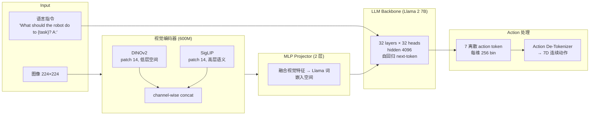
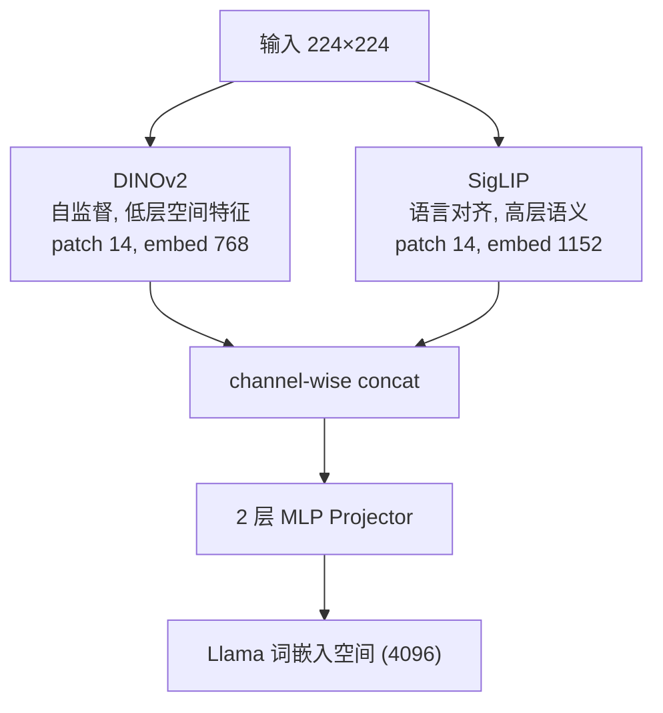
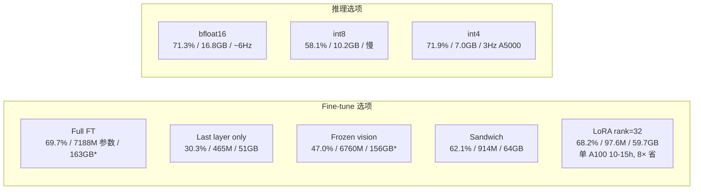

# OpenVLA 架构详解

> 配套 `card.json`。先用 Mermaid 把数据流画清,再用文字把每个组件讲透。所有数字来自论文(页码标注)。

## 1. 总体数据流(VLM fine-tune + action token 预测)

**关键点**:OpenVLA 无独立 action expert / DiT / flow matching。action 直接走 LLM token 通道,7 个离散 token 用 next-token CE 训练。这是"最简单可扩展 VLA"设计——直接借 LLM 生态(LoRA/量化/FSDP)(p4 Figure 2)。

## 2. 输入/输出契约

| 方向 | 名称 | 类型 | 说明 |
|---|---|---|---|
| 输入 | 图像 | image | 单张 224×224 RGB,第三人称 |
| 输入 | 语言指令 | text | 模板 "What should the robot do to {task}? A:" |
| 输出 | 机器人动作 | discrete→continuous | 7 维单步,每维 256 bin |

### 数值 sense:模型到底多大

| 项 | 值 | 出处 |
|---|---|---|
| DiT VLM | Llama 2 7B:32 layers × 32 heads,hidden 4096,ffn 11008 | Llama 2 公开规格 |
| DiT action | 无独立 action expert;7 token/步走 LLM 通道 | 论文 p4-5 |
| vision encoder | DINOv2-base(patch 14,embed 768)+SigLIP(patch 14,embed 1152)→concat→MLP 投 4096;共 600M | 论文 p4, Prismatic |
| 分辨率 | 224×224(试 384 无性能差但慢 3×) | 论文 p5-6 |
| VAE | 无 VAE;视觉编码器直接出 patch token | 论文 p4 |
| 每帧 latent 维 | 224²/14²→~256 patch token/视角;concat 后 MLP 投 4096 | 推算 |
| Chunk | 无 action chunk;单步 7 token;无 receding horizon | 论文 p9-10 |
| 上下文 | 单图+单语言;无历史帧无 episodic memory | 论文 p11 |
| 动作 | 7 维:Δx/y/z+Δroll/pitch/yaw+gripper;每维 256 bin,1%/99% 分位 | 论文 p5 |
| 训练 | 64×A100×14 天=21,500 A100-hours;batch 2048;27 epochs;lr 2e-5 无 warmup;action token acc 95%+;fine-tune vision encoder;FSDP+AMP+FlashAttention | 论文 p6 |

## 3. 为什么是离散 action token 而非连续 action expert

这是 OpenVLA 与后续 π0/Qwen-VLA 的根本区别(p4-5 §3.1-3.2)。

**OpenVLA 选择离散 token**:
- 把 7 维动作每维离散成 256 bin,覆写 Llama 词表最后 256 个最少用 token
- 用标准 next-token CE loss,只在 action token 上算
- 无需 DiT/flow matching 额外组件,直接借 LLM 训练基础设施
- 简单可扩展,但牺牲 action chunk(每步单 token 序列)和 action 多模态建模

**后续 VLA(π0/Qwen-VLA)选择连续 action expert**:
- 用 860M-1.15B DiT flow-matching action expert
- action 是连续张量经 self-attention,与 VLM 通过 hidden state 拼接
- 支持 action chunk(50/16 步)和多模态动作分布
- 但架构更复杂,需解耦训练(knowledge insulation / T2A 分阶段)

**trade-off**:OpenVLA 简单但 6Hz 单步;后续 VLA 复杂但支持 chunk 高频。OpenVLA 的 VLM fine-tune 框架被后续继承,action expert 部分被替换。

## 4. DINOv2+SigLIP 融合视觉编码器

**为什么融合**:Prismatic 论文证明 DINOv2+SigLIP 融合比单 SigLIP/CLIP 在多物体语言 grounding 任务强约 10%。DINOv2 给低层空间细节(精确抓取位姿),SigLIP 给高层语义(选对物体)。

**证据**:OpenVLA 在 BridgeData V2 language grounding 类任务显著超 RT-1-X/Octo(后者用 from-scratch 或单一编码器常操纵错物体)。这解释了为何 OpenVLA 7B 能超 RT-2-X 55B——融合视觉编码器补了数据规模差距。

## 5. Action 离散化细节

7 维动作(Δx, Δy, Δz, Δroll, Δpitch, Δyaw, gripper),每维独立离散成 256 bin。

**bin 宽用 1%/99% 分位定**(非 min-max):
- 抗 outlier——min-max 会被极端动作拉宽区间降低有效粒度
- 保留中间 98% 数据的细粒度

**256 token 覆写 Llama 词表最后 256 个最少用 token**:
- Llama tokenizer 只留 100 个 special token 位,不够 256
- 选最少用的 256 个覆写,最小化对原语言能力破坏

**de-tokenize**:预测的 7 个离散 token 映射回 7 维连续值,直接执行。

## 6. 训练 recipe:反 LLM 直觉的发现

OpenVLA 在 BridgeData V2 上做小规模消融定 recipe(p5-6 §3.4):

| 设计 | OpenVLA 选择 | LLM/VLM 常规 | 理由 |
|---|---|---|---|
| 训练 epochs | 27 | 1-2 | VLA 需更多迭代,action token accuracy 训到 95%+ 才停 |
| vision encoder | fine-tune | 通常冻结 | 预训练视觉不含足够细粒度空间细节做精确控制;冻结掉性能(frozen-vision 47%) |
| 学习率 | 2e-5 固定 | 常带 warmup | 同 VLM 预训练,warmup 无益 |
| 图像分辨率 | 224×224 | VLM 常 384+ | 384 无性能差但训练慢 3× |

**关键 ablation**:fine-tune vision encoder 至关重要。frozen-vision 掉到 47%,sandwich(解冻视觉+token embedding+last layer)62%,full FT 69.7%,LoRA 68.2%(匹配 full)。证明视觉特征必须适应机器人场景,不能冻。

这套 recipe 给后续 VLA 工作(π0/Qwen-VLA)提供基线参照——虽然后者用连续 action expert,但"fine-tune vision encoder""更多 epoch""VLM-DiT 不对称需分阶段"等发现被继承。

## 7. LoRA + 4bit 量化:VLA 民主化

**LoRA**:rank=32 应用于所有 linear 层,只训 97.6M(1.4% of 7B),VRAM 59.7GB。性能 68.2% 统计持平 full FT 69.7%。单 A100 10-15h fine-tune 一任务,比 full FT(8×A100 5-15h)省 8× 算力。rank 64 无差异,故默认 32。

**4bit 量化**:用 LLM serving 的 QLoRA 类技术。4bit 性能 71.9% 持平 bfloat16 71.3%,显存 7GB(可跑消费卡)。int8 反而掉到 58.1%——因 8bit 量化开销慢(A5000 1.2Hz 改变系统动态 vs 训练 5Hz),4bit 因减少显存传输反快(A5000 3Hz 更匹配)。

**意义**:这是把 LLM 生态 LoRA/量化工具搬到 VLA 的标杆。让 VLA 从服务器集群走向消费级 GPU,是广泛采用的关键。

## 8. 与后续 VLA 路线的根本区别

| 维度 | OpenVLA | π0.7 | Qwen-VLA |
|---|---|---|---|
| action 表示 | 离散 token(256 bin) | 连续(flow matching 860M expert) | 连续(flow matching 1.15B DiT) |
| action chunk | 无(单步 7 token) | 50 步 | 16 步 |
| 多模态动作 | 无(被平均) | 有(flow matching) | 有(flow matching) |
| 训练 recipe | VLM fine-tune 单阶段 | knowledge insulation+多维 context | T2A→CPT→SFT→RL 四阶段 |
| 推理频率 | ~6Hz(单步) | 38-127ms | 少步 Euler |
| 跨本体 | 单臂末端(WidowX/Google/Franka) | 多本体+移动+人类视频 | 多本体+导航+VL |
| 开源 | 完全开源(标杆) | 闭源(商业) | 开源 |

OpenVLA 是 VLA 开源化的里程碑,后续工作继承其 VLM fine-tune 框架但换连续 action expert 解锁 action chunk 和多模态。OpenVLA 的简单离散 token 路线在可靠性和高频控制上有上限,这是后续改进的动机。
