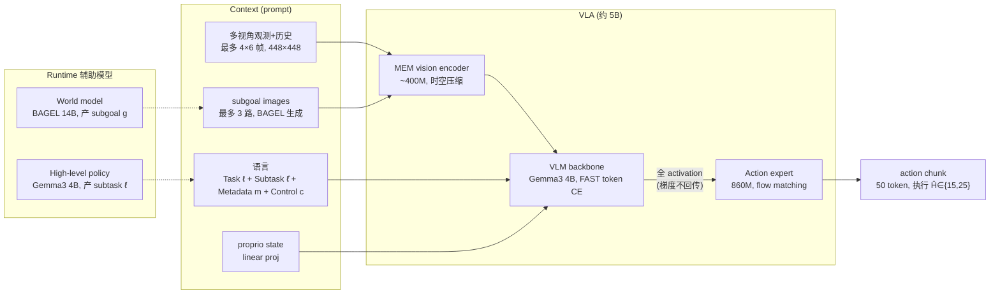
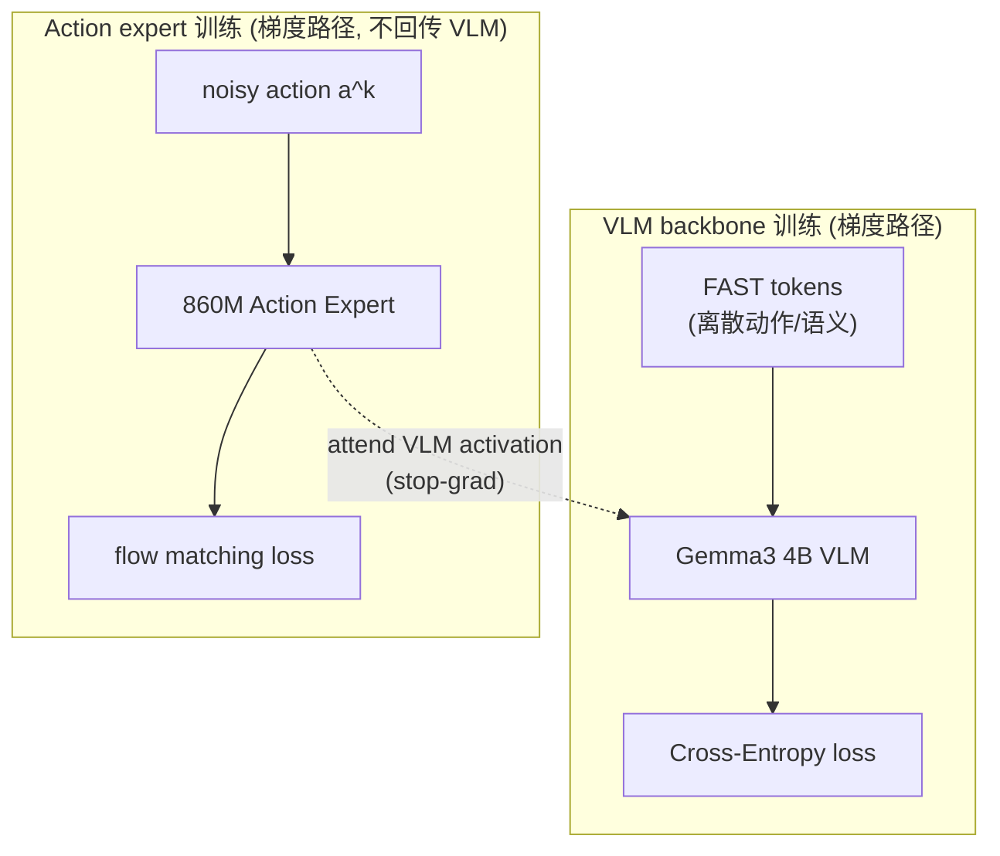
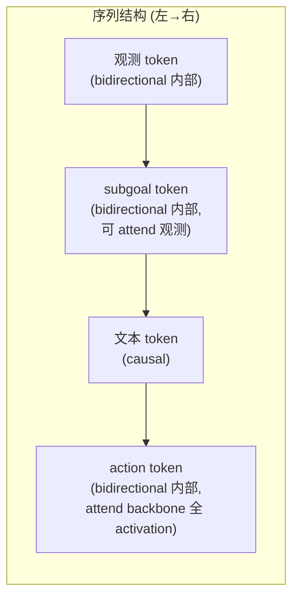
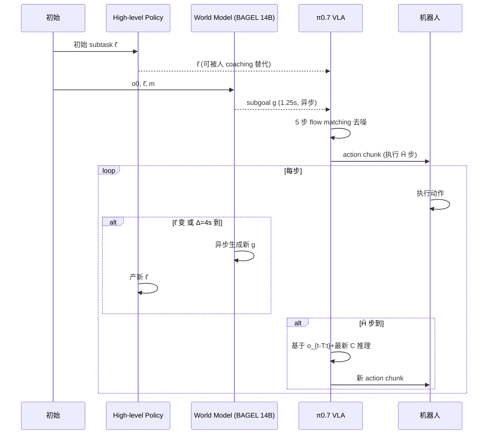

# π0.7 架构详解

> 配套 `card.json`。先用 Mermaid 把数据流和 attention 模式画清,再用文字把每个组件讲透。所有数字来自论文(页码标注)。

## 1. 总体数据流(训练 vs 推理)

**关键点**:VLA 本体是 4B VLM + 400M vision + 860M action expert(knowledge insulation 解耦)。推理时 subtask 由 high-level policy 产、subgoal 由 BAGEL 14B 世界模型产,异步喂给 VLA。是三模型系统非端到端(p4 Fig.2, p22 Fig.19)。

## 2. 输入/输出契约

| 方向 | 名称 | 类型 | 说明 |
|---|---|---|---|
| 输入 | 多视角观测 | image | 最多 4 路(前+2腕+后),每路 6 历史帧(stride 1s),448×448 |
| 输入 | proprio | vector | 关节状态(含历史),linear proj |
| 输入 | task/subtask 指令 | text | ℓ 总任务 + ℓ̂ 子任务 |
| 输入 | subgoal images | image | 最多 3 路近未来期望图,BAGEL 生成 |
| 输入 | episode metadata | structured | speed/quality(1-5)/mistake |
| 输入 | control mode | text | joint/ee |
| 输出 | action chunk | continuous | 50 token,5 步去噪,执行 Ĥ∈{15,25} |

### 数值 sense:模型到底多大

| 项 | 值 | 出处 |
|---|---|---|
| DiT VLM | Gemma3 4B(初始化);FAST token 离散 CE | 论文 p3-4 |
| DiT action | 860M;50 action token;adaptive RMSNorm;5 步 flow matching | 论文 p3, p7 |
| vision encoder | MEM ~400M;448×448;时空压缩固定 token 数 | 论文 p3-4, p6 |
| 分辨率 | 观测/subgoal 448×448;世界模型 ViT 448×336、VAE 512×384 | 论文 p22 |
| VAE | BAGEL 世界模型 VAE(patch 16);VLM 观测 ViT(patch 14) | 论文 p22 |
| 每帧 latent 维 | 448²/14² ≈ 1024 patch token/view(估算) | 推算 |
| Chunk | action H=50;执行 Ĥ∈{15,25};5 步去噪;RTC 模拟 0-12 步延迟(240ms @50Hz) | 论文 p7-8 |
| 上下文 | 4 视角×6 帧+3 subgoal;历史 30% drop、后视 30% drop、subgoal 25% batch、subtask 30% drop、metadata 15%全+5%单字段 | 论文 p5-6 |
| 动作 | joint/ee;UR5e 20Hz、其它 50Hz;双臂移动 2×6DoF+1夹爪+1-2升降+3底盘 | 论文 p7-8 |
| 训练 | Gemma3 4B 初始化;knowledge insulation;CFG β∈{1.3,1.7,2.2};推理 38-127ms;世界模型 1.25s/张 | 论文 p5, p22 |

## 3. Knowledge Insulation:VLM 和 action expert 解耦训练

这是 π 系列的核心训练 recipe,π0.7 继承并加 context 丰富化(p3)。

**为什么这样**:VLM 要稳定训练(离散 CE),action expert 要捕获动作多模态(flow matching),两者 loss 性质不同直接耦合会互相干扰。knowledge insulation 让 VLM 学稳定语义表征,action expert 在固定 backbone 上学连续动作分布。这是"大 VLM + 小 action head"范式稳定化的标准做法。

## 4. Block-causal attention 模式

观测和 subgoal 是 block-causal bidirectional(自己内部全互注意),subgoal 可 attend 观测但观测不 attend subgoal(未来不泄漏到当前)。文本 causal(后 attend 前)。action token 内部 bidirectional 且能 attend VLM 全部 activation,但梯度不回传 VLM。

CFG 推理时正负样本 pack 成 attention tree 两分支互不 attend(p22 Fig.19)。世界模型更复杂:3 路图(current-ViT、current-VAE、noisy goal-VAE)block-bidirectional,3 路 CFG(±text × ±img)比 VLA 的 2 路更复杂。

## 5. 多维 context conditioning 的 dropout 策略

这是 π0.7 最核心的设计——让模型学任意 prompt 子集(p5):

| 组件 | drop 概率 | 理由 |
|---|---|---|
| 历史 frames | 30% 全 drop | 让模型学无历史也能做 |
| 后视 camera | 30% drop | 不所有平台有后视 |
| subgoal images | 25% batch 加 | 加了 action 预测变 inverse dynamics 太简单,多了反而依赖 |
| subtask ℓ̂(有 subgoal 时) | 30% drop | visual subgoal 可替代文本 |
| episode metadata 全 | 15% drop | 让模型学无 metadata 也能做 |
| 单字段(speed/quality/mistake) | 各 5% drop | 部分标注场景 |
| control mode | 不 drop | 始终需要 |

推理时任意组合子集,且可 CFG 对任意部分(主对 metadata,β∈{1.3,1.7,2.2})引导动作朝高质量/快速模式。

## 6. 推理流程(Algorithm 1)

异步推理:world model 生成 subgoal 在独立线程,VLA 推理总用最新可用 subgoal/subtask。training-time RTC 模拟 0-12 步延迟(最大 240ms @50Hz)保证轨迹平滑。

## 7. 为什么 context 丰富化使数据 scaling 成立

这是论文最核心的论点,Fig.18 给决定性证据:

**无 metadata**:数据越大越差。因为混合质量数据(含失败、慢速)不加标注会被平均,模型学到次优行为。

**有 metadata**:数据越大越好,即使平均质量下降。因为 metadata 让模型能区分"这条高质量快速"vs"这条失败演示",把不同模式分别学到,推理时 metadata prompting(quality=5/mistake=false)选最优模式。

这个论点的杠杆意义:数据获取从"精心筛选高质量示教"变成"来者不拒靠 metadata 标注",大幅降低数据成本。且 autonomous eval data(含 RL specialist rollout)可蒸馏进通用模型——π0.7 out-of-the-box 匹配 RL specialist(Fig.6/7)。

## 8. 与 π0.5/π0.6 的架构差异

| 维度 | π0.5 | π0.6 | π0.7 |
|---|---|---|---|
| backbone | PaliGemma | Gemma3 4B | Gemma3 4B + MEM |
| history | 短 | MEM memory | MEM + 多维 context |
| context | 仅语言 ℓ | 语言 ℓ | ℓ + ℓ̂ + subgoal + metadata + control |
| 数据 | 高质量示教 | + 部分 autonomous | + autonomous + 人类视频 + web + 失败 |
| action expert | flow matching | flow matching | flow matching + knowledge insulation |
| subgoal | 无 | 无 | BAGEL 14B 生成 |
| 跨本体 | 弱 | 中 | 强(零样本叠衣匹配人类) |

π0.7 的核心增量在 context 丰富化 + 数据多样性协同,而非架构大改——这是"用更丰富 prompt 解锁异质数据"的方法论升级。
