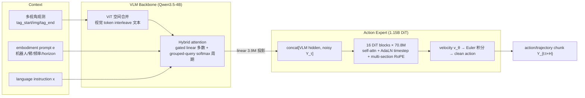
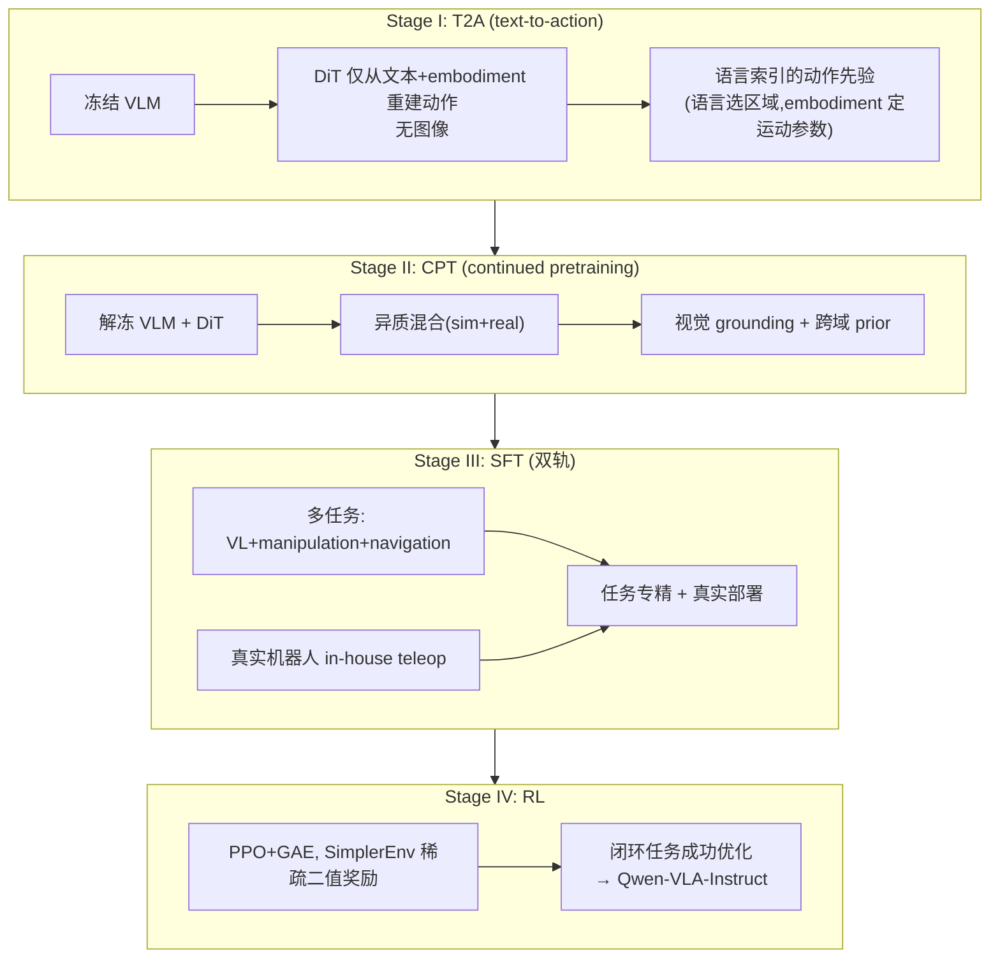
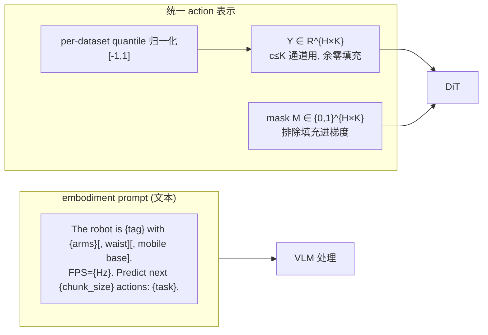
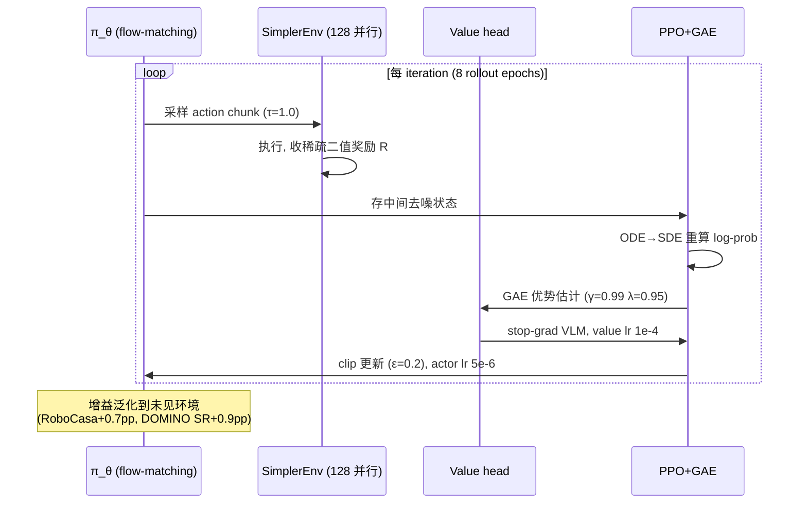

# Qwen-VLA 架构详解

> 配套 `card.json`。先用 Mermaid 把数据流和四阶段训练画清,再用文字把每个组件讲透。所有数字来自论文(页码标注)。

## 1. 总体数据流(VLM + DiT action expert)

**关键点**:VLM 处理 embodiment prompt+多视角+语言出 hidden states,经 linear 投影与 noisy action 拼接进 DiT。DiT 16 blocks 做 flow matching 出 clean action。action expert 与 VLM 通过 hidden state 拼接+joint self-attn 耦合,不是统一自回归(p4 §2.2)。

## 2. 输入/输出契约

| 方向 | 名称 | 类型 | 说明 |
|---|---|---|---|
| 输入 | 多视角观测 | image/video | tag 包裹,ego/wrist 等 |
| 输入 | embodiment prompt | text | 模板描述本体/频率/horizon |
| 输入 | 语言指令 | text | 粗或细 caption |
| 输出 | action/trajectory chunk | continuous | H×K,c≤K 通道+零填充+mask |

### 数值 sense:模型到底多大

| 项 | 值 | 出处 |
|---|---|---|
| DiT VLM | Qwen3.5-4B,原生多模态;hybrid attention;ViT 空间合并 | 论文 p2, p4 |
| DiT action | 1.15B;16 blocks × 70.8M=1.13B;projection 4.9M;VLM→DiT 3.9M;timestep 2.8M;AdaLN 4.7M | 论文 p4 |
| 分辨率 | ViT 空间合并(具体未明);导航 2FPS;合成 50Hz | 论文 p12 |
| VAE | 无独立 VAE;raw action 空间 flow matching;per-dataset quantile 归一化[-1,1] | 论文 p8-9 |
| 每帧 latent 维 | VLM hidden→DiT channel 经 3.9M linear;Y∈R^{H×K} | 论文 p4 |
| Chunk | SFT 操控 H=16;导航 H=8;合成 50Hz;RL H=16 τ=1.0/0.6 | 论文 p14, p15 |
| 上下文 | 多视角+embodiment+instruction;无 episodic memory(未来);navigation 有历史窗 | 论文 p4, p26 |
| 动作 | 操控 ΔEEF+Euler/quaternion+abs joint+gripper+DH;导航 (Δx,Δy,Δθ);人类 腕 SE(3)+10 eigengrasps=32维/步 | 论文 p5, p9-10 |
| 训练 | T2A 2000 步 Sig-Norm→CPT→SFT(VL 0.1/action 1.0)→RL(PPO γ=0.99 λ=0.95 ε=0.2,SimplerEnv,128 并行,8192 transition/iter,value lr 1e-4/actor 5e-6) | 论文 p6-7, p14-15 |

## 3. 为什么是四阶段训练(T2A→CPT→SFT→RL)

这是 Qwen-VLA 最核心的设计,由"动作学习是结构化解压缩"视角驱动(p6 §3.1)。

**为什么分阶段**:VLM 已预训练而 DiT 随机初始化,naive 联合训练浪费算力且噪声梯度扰动 VLM。T2A 先纯文本建语言索引的动作先验(语言选动作空间区域,embodiment prompt 定平台运动参数,flow-matching 动力学),CPT 才加视觉 grounding,SFT 专精,RL 闭环。每阶段闭合前一阶段缺口。

**Fig.6 决定性证据**:T2A 加图 -2.87pp(走视觉捷径稀释先验);Sig-Norm(T2A)+Beta(SFT)最佳 71.09%,反过来都掉;2000 步最佳 40000 步过拟合 60.42%。证明 T2A 必须无视觉且短训。

## 4. Embodiment-aware prompt + 统一 action 表示

**为什么这样**:多本体动作维度/控制约定/horizon 都不同。embodiment prompt 是唯一本体特定接口,让模型知道当前控制什么。统一 action 表示用零填充+mask 让单一 DiT 处理所有控制模式,无需 per-embodiment head。每 dataset 保留原生动作格式靠 prompt 告知。

**Table 10 证据**:Multi-MLP/Concat/Zero-Pad 三种 projection 在 Bridge/Robocasa 差异<1.2pp,Zero-Padding 参数最少(2h·dmax vs 2h·Σdi)故默认。证明一旦建共享 latent 空间,projection 设计影响有限——embodiment prompt 才是关键。

## 5. DiT flow-matching action expert 细节

single-stream DiT,1.15B。把 VLM hidden(经 3.9M linear 投影)与 noisy action chunk Y_τ 拼接成一条序列,进 16 blocks 的 joint self-attention + AdaLN timestep + multi-section RoPE。

**loss 设计**(p5 §2.5):per-channel per-step MSE + 两级平均。先对每 active 通道 k<c 算 MSE(除以该通道有效步数),再对 c 通道均匀平均。防 padding 主导梯度,且每控制维度等贡献。

**推理**:少步 Euler 积分从 τ=1 到 τ=0 出 action chunk,低延迟实时控制。

**RL log-prob 挑战**(p15 §4.2):flow-matching 是隐式密度(velocity field + 迭代去噪),不像自回归 softmax 直接给 log-prob。解法:把 deterministic probability-flow ODE 转 SDE 注入受控噪声,每步成显式 Gaussian 可解析算 log-prob 给 PPO 重要性比。默认每 rollout 随机选一去噪步,只需一次额外 DiT 前向。

## 6. RL 后训练:为什么增益泛化

**为什么增益泛化**(Table 11):RL 在 SimplerEnv +2.9pp(训练环境),但 RoboCasa +0.7pp、RoboTwin-H +0.1pp、LIBERO +0.1pp、SimplerOOD +0.4pp、DOMINO 零样本动态 SR 25.7→26.6——证明 task-success 优化的"decisive 执行+误差恢复"不局限于训练环境。关键:RL 优化的是与视觉域无关的任务成功指标,鼓励策略依赖语义视觉特征而非 renderer 纹理;CPT 已暴露 sim+real 视觉分布,backbone 不绑 renderer。

## 7. 与其它 VLA 路线的根本区别

| 维度 | Qwen-VLA | π0.7 | DreamZero/HarmoWAM | OpenVLA |
|---|---|---|---|---|
| 统一任务 | 操控+导航+VL+人类 | 操控+coaching | 操控(video-action) | 操控 |
| 跨本体接口 | embodiment prompt | metadata+control mode | 无(单本体) | 无(单本体) |
| action expert | DiT flow-matching 1.15B | flow-matching 860M | joint video-action | 离散 token |
| 训练 recipe | T2A→CPT→SFT→RL | context 丰富化 | 联合/双 expert | SFT |
| 物理先验 | 无 video 预测 | BAGEL subgoal | video diffusion | 无 |

Qwen-VLA 的核心增量:把多本体从架构问题变成 prompt 问题(embodiment prompt),把动作学习从一锅训变成解压缩四阶段(T2A),把操控+导航+VL 统一进单模型。这是"统一 VLA"主张的最系统化实现。
