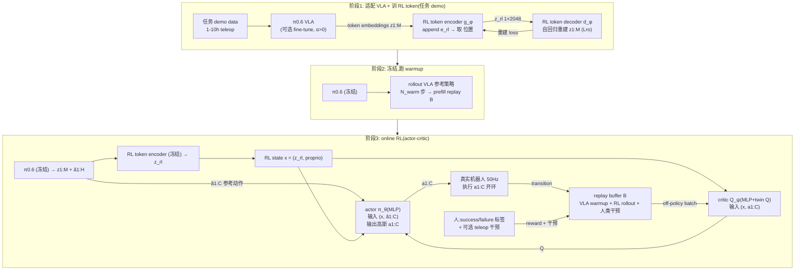

# RL Token 架构详解

> 配套 `card.json`。RLT 是一个**冻结 VLA + 瓶颈表示 + 小 actor-critic** 的微调框架,而非新 VLA。下面先用 Mermaid 把数据流和训练闭环画清,再用文字把每个组件讲透。所有数字来自论文(页码标注)。

## 1. RLT 在系统里的位置(三阶段训练)



**阶段 1**(任务 demo,1-10h):训 RL token encoder g_φ + decoder d_φ(可选同时 fine-tune VLA)。g_φ 在 z1:M 末尾 append e_rl,过 transformer,取该位置输出 z_rl(1×2048 瓶颈)。d_φ 从 z_rl 自回归重建 z1:M,逼 z_rl 保留 task-relevant 信息。训 2000~10000 gradient steps 后冻结 φ + VLA。

**阶段 2**(warmup):用冻结的 VLA 参考策略 rollout N_warm 步,prefill replay buffer B,给 critic 初始学习信号。

**阶段 3**(online RL):rollout 和学习异步。每个 chunk 边界:VLA 产 ã1:H + RL token 模块产 z_rl;actor 输出 a1:C ~ N(μ_θ(x,ã), σ²I);执行 a1:C 开环(50Hz 即 0.2s)。人可干预(teleop 替换 actor 输出,干预时 ã 也换人类动作)。所有 transition 进 B。off-policy TD3 风格更新 critic(twin Q 取 min),actor 用 -Q + β·‖a-ã‖² 更新。

## 2. 输入/输出契约

| 方向 | 名称 | 类型 | 说明 |
|---|---|---|---|
| 输入 | camera images | image | 2 腕部 + 1 base,喂冻结 π0.6 产 z1:M |
| 输入 | language | text | 每任务固定一条指令(实验) |
| 输入 | proprio | vector | 关节位置+速度(screw);末端位姿(zip/Ethernet/charger) |
| 输入 | VLA 参考 chunk | continuous | 冻结 π0.6 采样的 H=50 步动作;RL 用前 C=10 步 ã1:C |
| 输出 | RL action chunk | continuous | C=10 步 @50Hz = 0.2s,14 维/步 = 140 维 |
| 输出 | Q value | scalar | critic 估的 chunk-level C-step return |

**控制频率**:50Hz;VLA chunk H=50 (1s);RL chunk C=10 (0.2s);replay stride 2 存中间步,1 秒数据≈25 样本。

### 数值 sense

| 项 | 值 | 出处 |
|---|---|---|
| 主干 | π0.6 = SigLIP 400M + Gemma 4B + 860M action expert;总 ~5.3B(冻结) | 论文 p4 Figure 2 |
| RL token | 1×2048 维 bottleneck 向量;encoder/decoder φ 轻量 transformer(精确层数论文未给) | 论文 p4, App B |
| actor-critic | 2 层 MLP hidden 256(zip/Ethernet/charger);3 层 MLP hidden 512(screw);参数量 << 1M | 论文 App B |
| RL chunk | C=10 步 @50Hz = 0.2s;每步 14 维 → 140 维 chunked action | 论文 p7, App B |
| VLA chunk | H=50 步 @50Hz = 1s | 论文 p3 |
| 控制频率 | 50Hz;chunk 内开环执行前 10 步后重新规划 | 论文 p7 |
| RL token 训练 | φ 训 2000~10000 gradient steps on 单任务 demo;VLA 可选 fine-tune;之后全冻结 | 论文 App B |
| online RL | 400~1000 episodes/task;15min~5h 真实数据;U2D G=5;2 critic 更新 per 1 actor 更新;reference 50% dropout | 论文 p5, App B |
| replay subsampling | stride 2 存 <x0,a0:C>,<x2,a2:C+2>...;1 秒≈25 样本;off-policy 复用 VLA+RL+人类 | 论文 p5, App B |
| reward | 稀疏 +1(人标 success)/0(failure);episode 30~120s(1500~6000 步);critical phase 5~20s(250~1000 步) | 论文 p6-7 |
| critic | twin Q 集成(TD3),取 min 算 target;target network ψ' | 论文 p4, App B |

**给听众的标尺**:5.3B 冻结 VLA + 1×2048 RL token + 几层 MLP(256/512 hidden)+ C=10 chunk + 50Hz + U2D=5 + 15min~5h 真实数据。最该记住的是"小":actor-critic << 1M 参数,所以几小时能学。

## 3. RL token:为什么需要瓶颈表示

这是 RLT 最核心的设计(p4)。

**问题**:VLA final-layer token embedding 高维(2048×M),直接喂 online RL 既算力贵又样本低效。但用 ResNet 这类通用视觉编码器,丢了 VLA 在大规模 web+机器人数据上学到的 manipulation-relevant 结构。

**解法**:在 VLA token 序列末尾 append 一个学习 embedding e_rl,过轻量 encoder transformer g_φ,取该位置输出 z_rl(1×2048)。训练 φ 时用一个 decoder d_φ 从 z_rl **自回归重建**原 embeddings:

```
Lro = E_D [ Σ_i ‖ h_φ(d_φ([z_rl, z̄_1:i-1]))_i - z̄_i ‖² ]
```

z_rl 必须保留足够信息才能让 decoder 重建,所以它是瓶颈——既压缩又保信息。stop-gradient 防 decoder 把 VLA embedding 拉偏,φ 只学"怎么压缩"不动 VLA。

**为什么有效**:消融证明换 ResNet-10 throughput 降 50%(p9 Figure 7)——RL token 编码了通用视觉编码器没有的 manipulation 结构。瓶颈设计让 z_rl 既保 VLA 知识又小到能挂轻量 MLP。

## 4. Chunk-level actor-critic:匹配 VLA 原生接口

这是 RLT vs 单步 RL 方法的核心差异(p3-4)。

**为什么单步失败**:50Hz 任务 episode 1500~6000 步,稀疏奖励只在 episode 末给。单步 RL 的 value function 要在 1500~6000 步 horizon 上做 credit assignment,reward 信号根本传不回去。HIL-SERL/PLD 在 Ethernet 任务完全失败就是直接证据(p8 Figure 6)。

**RLT 的解法**:actor/critic 都在 chunk 上操作。RL chunk C=10(0.2s)<VLA chunk H=50(1s)。critic 估 chunk-level C-step return:

```
Qψ(x, a1:C) ≈ Σ_{t'=1}^{C} γ^{t'-1} r_t' + γ^C · E_{a'~πθ}[Qψ'(x', a')]
```

TD horizon 从 1500~6000 步缩到 10 步级,reward 信号能传播。同时 C<H 让策略比 VLA 更 reactive(0.2s 重新规划 vs 1s)。replay stride 2 存中间步,1 秒数据产 ~25 样本,数据效率高。

## 5. Reference-action conditioning + KL anchor:把 RL 变成 local refinement

这是 RLT 让几小时数据够用的关键(p4-5)。

**机制**:actor 不从零生成,条件化于 VLA 采样的参考 chunk ã1:C:

```
πθ(a | x, ã) = N( μθ(x, ã), σ²I )
Lπ(θ) = E[ -Qψ(x, a) + β · ‖a - ã‖² ]
```

等于把 online RL 变成"在 VLA 先验附近做 local refinement",而非无约束搜索。

**reference action dropout**(反直觉但必要):条件化 ã 会让 actor 倾向抄作业(尤其 critic 还没信号时)。所以训练时 50% 概率把 ã drop 成零,逼 actor 保独立 action 通路。推理时 ã 必给。一旦 critic 有信号,actor 自然学会偏离 ã 去提升 Q。

**为什么有效**:消融 w-o BC Regularizer(β=0)跌最狠——无 anchor 让 actor 在全 140 维空间裸搜,几小时数据不够(p9 Figure 7)。w-o Pass-Through 最终能追平但学得慢+训练中失败多。两个机制叠加:ã 提供强初始分布,β 限制探索,dropout 防抄作业。

## 6. Critical-phase targeting + 两阶段训练:practicality 的关键

承认 VLA 不该全推翻,只在它最弱的 critical phase 用 RL 补(p5-6)。

**机制**:每 episode 先用 base VLA 跑 easy phase,人类操作员决定何时切到 RL policy 跑 critical phase(类 interactive imitation learning)。RL 只在 critical phase 存/训 transition。

**两阶段**(screw/zip tie):先在 critical-phase only 训(降低方差,集中数据),再扩到 full-task(让 RL 策略对 VLA 诱导的初始状态分布鲁棒)。最后可选短 fine-tune VLA 学会何时切 RL policy,实现 test-time 自动切换。

**为什么有效**:critical phase 5~20s(250~1000 步),把几小时数据集中在这段,才有可能学会。full-task 阶段让策略对 VLA 诱导的更宽状态分布鲁棒,部署更稳。

## 7. 训练闭环(sequence 图)

```mermaid
sequenceDiagram
  participant VLA as π0.6 (冻结)
  participant RLT as RL token encoder (冻结)
  participant Actor as actor π_θ
  participant Robot as 真实机器人 50Hz
  participant Buffer as replay buffer B
  participant Human as 人(标签+干预)

  loop 每个 chunk 边界
    VLA->>VLA: 处理图像+语言+proprio → z1:M
    VLA->>Actor: 采样参考 chunk ã1:C
    VLA->>RLT: z1:M
    RLT->>Actor: z_rl (1×2048)
    Actor->>Actor: π_θ(·|x,ã) → a1:C ~ N(μ,σ²)
    alt 人干预
      Human->>Robot: teleop a_human 替换 a1:C
      Human->>Buffer: 存 (x, a_human, ã_human, r, x')
    else 自主
      Actor->>Robot: 执行 a1:C 开环 0.2s
      Robot->>Buffer: 存 (x, a1:C, ã, r, x')
    end
    Human->>Buffer: 标 success/failure (r)
  end

  loop 异步 off-policy 更新
    Buffer->>Actor+Critic: 采样 batch (U2D=5)
    Critic->>Critic: twin Q TD3 更新 (取 min)
    Actor->>Actor: -Q(x,a) + β·‖a-ã‖²
  end
```

**关键**:off-policy 让 VLA warmup + RL rollout + 人类干预全进 buffer 复用;高 U2D=5 在数据稀缺下榨干每条 transition;twin Q + target network 防 value overestimation。这套是 SERL/RL100 验证过的 sample-efficient real-world RL 配方,RLT 继承,只是把状态表示从 ResNet 换成 RL token。

## 8. 与其它 VLA-RL 路线的根本区别

| 路线 | 更新什么 | 动作接口 | 探索约束 | 真实数据预算 |
|---|---|---|---|---|
| RECAP / 全量 VLA RL | 整个 VLA | chunk | 无(全模型) | 大规模、算力贵 |
| ConRFT / PLD(单步 residual) | 冻结 VLA + 单步 head | 单步 | 弱 | 几小时但单步 credit assignment 失败 |
| DSRL(diffusion noise space) | latent noise policy | chunk(隐式) | 强约束 VLA 动作 | 高成功但 throughput 低 |
| Policy Decorator | 残差 + 超参缩放 | 单步 | 弱 | sim only,百万步 |
| **RLT** | **冻结 VLA + 小 actor-critic** | **chunk C=10** | **条件化 ã + KL anchor** | **15min~5h 真实数据** |

RLT 的位置:介于"全量 RL"和"强约束 latent RL"之间,既保 VLA 知识(冻结+RL token),又允许 local refinement(条件化 ã + KL 而非强约束),且 chunk-level 匹配 VLA 原生接口——三者叠加让几小时真实数据精修毫米级任务成为可能。
