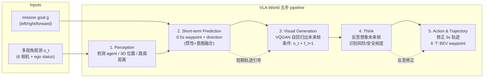
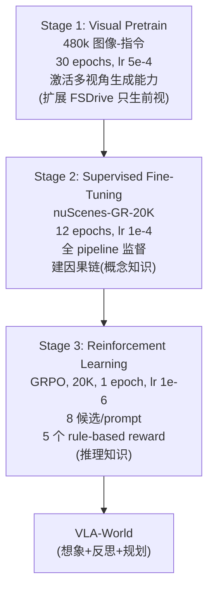
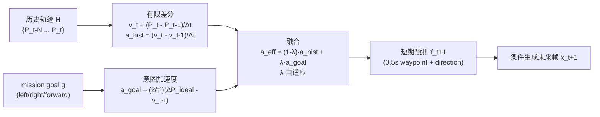
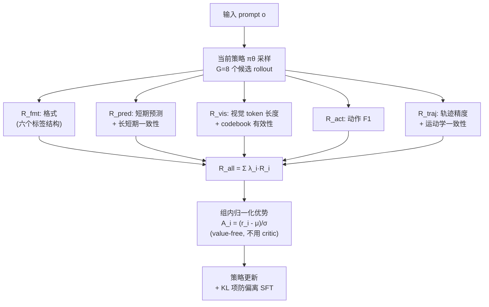

# VLA-World 架构详解

> 配套 `card.json`。先用 Mermaid 把想象+反思闭环、三阶段训练、GRPO 画清，再逐组件讲透。所有数字来自论文 Sec 4.1 + Table 1-4。

## 1. 总体范式：想象 + 反思闭环

**核心因式分解**（p4 Eq. 2）：`p(τ, x_{t+1} | o, g) = p(τ|o,g) · p(x_{t+1}|o, τ_{t+1})`。纯 VLA 只关注左因子（policy），纯世界模型只关注右因子（imagination）。VLA-World 把两者接起来：先用短期轨迹 τ̂ 引导生成未来帧 x̂（imagination），再对 x̂ 做反思 f_ref(o, x̂, τ̂) 输出修正轨迹 τ̃。

**为什么这样**：短期预测未来帧天然编码丰富时空信息（ego motion + 周围 agent 行为），是反思的可靠依据。反思能修正直觉预测忽略的风险（如行人突然进入车道）。消融显示 w/o Reasoning L2 从 0.30 涨到 0.85（+0.55m），反思贡献最大。

## 2. 三阶段训练

**三阶段对应三种知识**（p1 Figure 1）：
- Stage1 生成知识（cold start）：让模型学会理解驾驶世界，能生成未来帧。
- Stage2 概念知识（SFT）：用 imitation learning 建 perception→prediction→generation→think→action 的因果链。
- Stage3 推理知识（RL）：GRPO 让模型在生成未来上交互探索，学会自我验证、丢弃不安全轨迹。

**消融结论**（p8 Table 4a）：SFT 比 RL 重要。w/o SFT L2 0.85（RL 没冷启动无法导航搜索空间），w/o RL L2 0.71（RL 只是精修）。SFT 是根基，RL 是提升。

## 3. 短期轨迹预测：物理动力学融合

**机制**（Appendix A.2）：从历史轨迹差分估计速度 v_t 和历史加速度 a_hist（惯性项）；goal 映射到目标偏移算出意图加速度 a_goal（意图项）；线性融合 a_eff = (1-λ)·a_hist + λ·a_goal。

**为什么**：纯恒定加速度模型无法捕捉 goal 驱动的突然机动；纯意图模型不物理平滑。融合让短期预测既物理平滑又能响应导航指令，为生成未来帧提供物理可信条件。

## 4. GRPO：value-free RL + 5 个 rule-based reward

**机制**（p6 Sec 3.5 + Appendix A.1）：GRPO 不用 critic（区别于 PPO），组内归一化优势 A_i = (r_i - μ)/σ 提供动态 baseline。5 个 rule-based reward 覆盖整条 pipeline（格式/短期预测/视觉约束/动作 F1/轨迹）。KL 项防止偏离 SFT checkpoint，避免 reward hacking。

**为什么 rule-based**：避免神经 reward model 的 reward hacking，且 rule-based 可解释、可控。让模型学会 Self-Verification，丢弃幻觉/不安全轨迹。

## 5. 输入/输出契约

| 方向 | 名称 | 类型 | 说明 |
|---|---|---|---|
| 输入 | 多视角观测 o_t | image | nuScenes 6 相机视角 |
| 输入 | ego status S_t | vector | 速度/加速度/yaw rate |
| 输入 | mission goal g | discrete | left/right/forward |
| 输出 | perception | text | 检测 agent + 3D 位置 + 路肩距离 |
| 输出 | short-term prediction | text+trajectory | 0.5s waypoint + direction |
| 输出 | imagined future frame | image (VQGAN token) | 任一视角 0.5s 后，128×192 |
| 输出 | reflective reasoning | text | 重要 agent + 风险 + 安全裕度 |
| 输出 | final trajectory | trajectory | 3s horizon，6 个 BEV waypoint |

## 6. 数值 sense：模型到底多大

| 项 | 值 | 出处 |
|---|---|---|
| DiT 规格 | Qwen2-VL-2B 主干（2B 参数 VLM transformer）；VQGAN tokenizer 离散 codebook | 论文 Sec 4.1 |
| 总参数 | 2B（Qwen2-VL-2B）| 论文 Sec 4.1 |
| 分辨率 | 生成图像 128×192（FSDrive 同款）；输入 6 相机 nuScenes 原生分辨率 | 论文 Table 2 |
| VAE | VQGAN（非 VAE）：图像离散化为 codebook token 序列；无连续 latent 压缩比概念 | 论文 Sec 3.3 |
| 每帧 latent 维 | VQGAN codebook token 序列，128×192 图像典型 ~256-1024 token（N 论文未明示）| 推算 |
| Chunk | 推理 step 0.5s；轨迹 horizon 3s = 6 个 waypoint；nuScenes 2Hz 采样 | 论文 Sec 3.1/3.4 |
| 上下文 | o_{1:t} 历史观测 + ego status + goal；具体历史长度未明示 | 论文 method |
| 动作 | 轨迹 waypoint（BEV 2D）；高层动作离散 manoeuvre（forward/left/right + keep/acc/dec/stop）| 论文 Sec 3.1 + Table 3 |
| 训练 | Stage1: 30 epochs, AdamW lr 5e-4, per-device batch 16, 8×80GB, 480k。Stage2 SFT: 12 epochs, lr 1e-4, nuScenes-GR-20K。Stage3 GRPO: 1 epoch, lr 1e-6, global batch 16, 8 候选/prompt | 论文 Sec 4.1 |

**Qwen2-VL-2B 为什么够用**：自动驾驶轨迹规划是 BEV 2D waypoint，不是机器人高维关节控制，2B VLM 的推理能力足够。且 VLA-World 继承 FSDrive 的对齐策略，Stage1 预训练已经激活了视觉生成能力。

**VQGAN vs 连续 latent diffusion**：VQGAN 离散 token 让视觉生成天然兼容 LLM 自回归（next-token prediction），不需要额外的 diffusion head。代价是生成质量受 codebook 限制（FID 9.8 vs diffusion 类 GEM 10.5 接近但未显著超越），且离散化损失高频细节。

## 7. 与其它 VLA/世界模型路线的根本区别

| 路线 | 想象 | 反思 | 底座 | 实时性 |
|---|---|---|---|---|
| 纯 VLA（OmniDrive/ELM）| 无 | 无 | VLM | 高 |
| 纯世界模型（DriveDreamer/OccWorld）| 有 | 无 | 视频 diffusion | 中 |
| FSDrive | 有（仅前视）| 无 | Qwen2-VL-2B | 中 |
| DreamZero/BagelVLA（机器人 WAM）| 有（连续 latent）| 无显式 | video diffusion | 7Hz/1.23s |
| **VLA-World** | **有（多视角 VQGAN）** | **有（GRPO 强化）** | **Qwen2-VL-2B** | **未报告** |

VLA-World 的独特定位：**想象 + 反思闭环 + GRPO 强化推理链**，牺牲了实时性报告，换来了驾驶安全的显式推理。是 FSDrive 的直接升级版，把"生成未来帧作 CoT"升级为"生成未来帧 + 反思修正 + RL 强化"。
