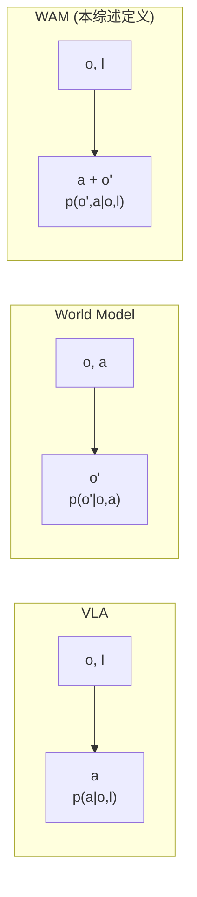
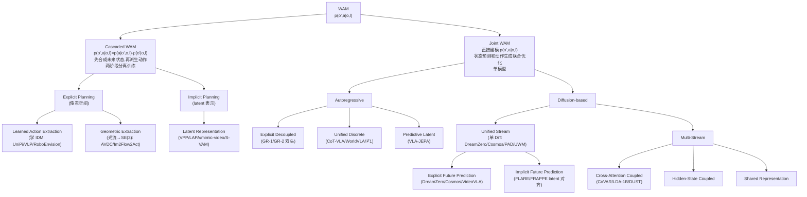
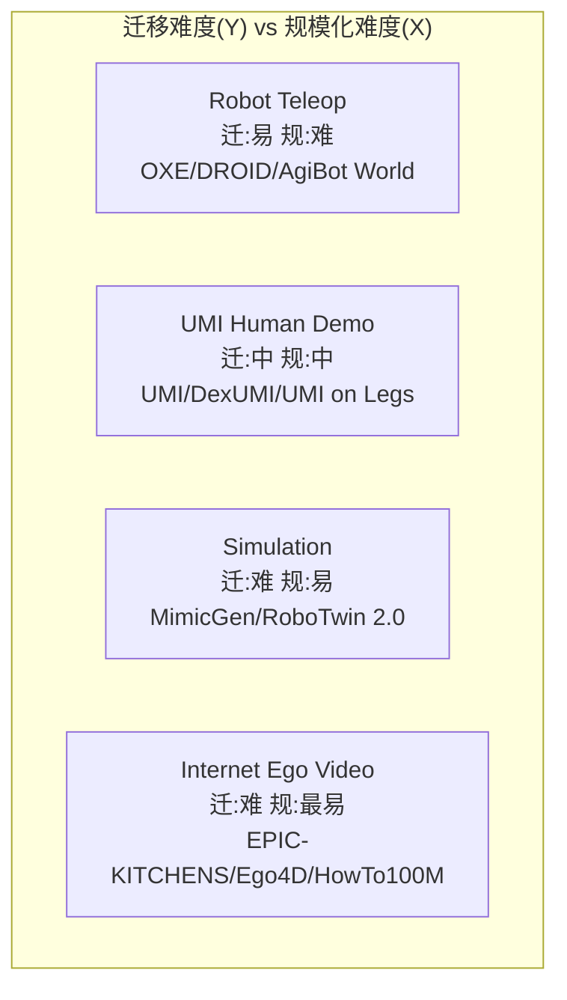

# WAM Survey 架构详解

> 配套 `card.json`。本综述不提模型,而是梳理 WAM 的设计空间。下面用 Mermaid 把核心 taxonomy 画清,再用文字讲透每个分支。所有数字来自论文(页码/表号标注)。

## 1. WAM 的概念契约(Section 2)

**WAM 的两准则**(p5):
1. **Forward Predictive Modeling**:必须生成或利用可量化的未来状态 o' 表示(显式像素视频/latent/光流/点云,或隐式 physics-grounded latent)。
2. **Coupled Action Generation**:动作 a 必须严格对齐到预测的未来状态 o'(联合概率输出,或 cascaded/joint 架构内的 policy conditioning)。

**形式化**:`L_WAM = E[-log p(o', a | o, l)]`。区别于 VLA 的 `L_VLA = E[-log p(a|o,l)]` 和 WM 的 `L_WM = E[-log p(o'|o,a)]`。

**概念边界厘清**(p6):
- WAM vs **VAM**(Video Action Model):WAM 是 modality-agnostic 超集(不只视频,含点云/触觉/力);VAM 限于视频对齐动作。
- WAM vs **Video Policy**:Video Policy 只继承视频 backbone 表示但不强制预测承诺(`p(a|o)` 即可);WAM 要求预测 o' 是推理输出的显式组件。
- WAM vs **AWM**(Action World Model,早期术语):WAM 重定位为 Agent(World 和 Action 对等),而非 AWM 那种"augmented simulator"。

## 2. 顶层二分:Cascaded vs Joint WAM(Section 4)

**核心 trade-off**:
- **Cascaded**:模块解耦训练简单,世界模型不需管机器人运动学,动作模型不需管长程场景预测;但两阶段误差累积、未来状态表示和动作对齐弱。
- **Joint**:联合优化对齐紧、能内部化因果依赖;但训练复杂、推理重。

## 3. Cascaded WAM 详解(Section 4.1)

三种子模式(p15 Figure 5):

### 1(a) Learned Action Extraction
视频生成模型出像素未来,学习 IDM 提取动作。UniPi 奠基(文本条件 U-Net 扩散 + CNN+MLP IDM);VLP 加 VLM 子动作生成 + tree-search value 评分控误差;RoboEnvision 用非自回归关键帧 + 插值;ThisThat 用 deictic 表达("this/that"+手势)消歧;Say Dream Act 用对抗蒸馏减步数 + 帧率无关预测;Veo-Act 用 gating——粗导航用 IDM,接触时切 VLA。

### 1(b) Geometric Extraction
视频未来转光流/轨迹,几何解析出 SE(3) 动作,**无需动作标注**。AVDC 先生成像素视频再算密集光流→SE(3);Im2Flow2Act 把流估计搬到 latent 空间,绕过像素生成;TesserAct 加深度/法向通道;MVISTA-4D 用轨迹级 latent 优化 + 残差 IDM。

### 2(a) Latent Representation(Implicit)
中间载体是 latent 未来表示,不生成像素。VPP/VILP/Video Policy/ARDuP/mimic-video/LAPA/S-VAM/OmniVTA/MWM 等。动作模型从 latent 解码。比 Explicit 高效,但 latent 表示质量决定动作精度。

## 4. Joint WAM - Autoregressive 详解(Section 4.2.1)

三种表示范式(p19 Table 2):

### Explicit Decoupled Representation
异构格式分头输出。GR-1(195M,GPT-style)双分支出未来 patches + 连续动作;GR-MG 加 [PROG] token 宏/微步层次;GR-2(30-719M)转 VQGAN 离散视觉 + CVAE 动作 chunking。跨模态 grounding 浅但灵活。

### Unified Discrete Representations
全量化进共享 LLM 词表,同一 next-token head。CoT-VLA(7B,VILA-U)混合注意力:先因果注意力生成视觉 CoT,再全注意力预测动作;WorldVLA(7B,Chameleon)modality-specific causal masking,禁止同 chunk 动作 token 互相 attend;RynnVLA-002(5B)加连续 Action Transformer 头;ℱ1(4.2B)MoT,Generation expert 出 VQ token,Action expert 从视觉 foresight 推动作(foresight-guided IDM)。统一但离散控制高方差、compounding error。

### Predictive Latent Representations
放弃显式 token,连续 latent 自回归。VLA-JEPA(2B,Qwen3-VL)在 latent 空间联合建模,未来帧只作监督目标,结构无泄漏;通过 embodied action token 条件化 flow-matching head 出动作。高效抽象但放弃像素可解释性。

## 5. Joint WAM - Diffusion-based 详解(Section 4.2.2)

### Unified Stream(单 DiT 联合去噪)
世界和动作在同主干。再分:
- **Explicit Future Prediction**:未来观测作直接预测目标。PAD(从头训 + action-free 视频共训);VideoVLA(用 CogVideoX-5B 预训练 backbone);UWM(独立 noise schedule 控世界/动作,一模型切多模式);Cosmos-Policy(Cosmos-Predict2 + latent frame injection,一 checkpoint 同时是 policy/WM/value function);DreamZero(Wan2.1-14B + 轻量 state/action encoder,闭环 KV-cache 替换);GigaWorld-Policy(动作只 attend 历史观测,推理跳过视频生成);X-WAM(加深度分支,RGB-D 联合);UD-VLA(离散 diffusion)。
- **Implicit Future Prediction**:未来信息通过辅助 future token 引入,latent 对齐。FLARE(可学 future token + 冻结 teacher encoder 对齐);FRAPPE(Mixture-of-Prefix-and-LoRA 多 alignment expert)。

### Multi-Stream(多分支耦合)
- **Cross-Attention Coupling**:视频/动作双 DiT,cross-attention 耦合。CoVAR(Bridge Attention);LDA-1B(共享 MM-DiT 注意力 + DINO latent,任务可切换);DUST(独立 noise timestep 解耦去噪轨迹)。
- **Mixture-of-Transformers**:LingBot-VA(autoregressive MoT + KV-cache 跨 chunk 因果一致性);DexWorldModel;Motus;Fast-WAM。
- **Hidden-State Coupling**:视频 DiT 隐藏状态条件化动作 DiT。
- **Shared Representation**:统一编码器先融合,再分头解码。

## 6. 数据生态四源(Section 5, Figure 7)

**关键洞察**:WAM 能利用 video-only 数据(video prediction objective 不需 action),打开 Internet Ego Video 这条最大规模(百万小时级)数据通路——这是 WAM 相对 VLA 的数据生态优势。VLA 必须有 action 标注。

## 7. 评测三维(Section 6)

| 维度 | 测什么 | 指标/benchmark | 问题 |
|---|---|---|---|
| Visual Fidelity | 视觉质量 | PSNR/SSIM/LPIPS/FVD/DreamSim/DINO | 忽略物理正确性(悬浮物体得分高) |
| Physical Commonsense | 物理常识 | VideoPhy/PhyGenBench/VBench-2.0/WorldScore/Physics-IQ | 与动作脱节 |
| Action Plausibility | 动作合理性 | WorldSimBench/WoW | 只测动作,忽略视觉-动作因果 |

**综述指出的核心空白**:三维度脱节,缺**联合评测指标**。提出方向:Counterfactual Consistency(动作如何适应想象未来的扰动)、Foresight-Conditioned Success(执行轨迹是否严格遵循视觉计划而非靠 spurious correlation)。

## 8. 七大开放挑战(Section 7)

1. **架构耦合缺对照实验**:各种结构策略并存但无匹配条件下系统比较,领域被"架构时尚"驱动。需 rigorous ablation 和理论分析。
2. **多模态物理状态表示**:WAM 几乎全预测 RGB,但接触密集操作的关键信息(触觉/力/声/材料 compliance)在像素不可见。需 modality-adaptive prediction。
3. **数据混合设计原理**:非机器人数据(尤其人类视频)的作用不清——是语义增强还是动态学习?需 embodiment-aware filtering。
4. **推理延迟**:DreamZero 7Hz vs 非 generative VLA 50Hz。需 task-adaptive predictive fidelity(识别任务所需最小充分世界模型,而非一味高保真加速)。
5. **评测方法论**:缺联合指标(视觉-动作因果一致性)。
6. **长程层次与时间上下文**:当前 WAM 多 System 1,需多分辨率预测(粗粒度规划 + 细粒度反应)和扩展时间记忆。
7. **安全验证**:WAM 的预测能力也让失败模式更危险。需 prediction-integrated safety(不确定性估计作 safety monitor 的一类输入)。

## 9. 数值 sense:综述覆盖多大

| 项 | 值 | 出处 |
|---|---|---|
| 综述方法数 | 100+ 篇 WAM + 数十背景/数据/评测;Figure 1 时间线列 ~60 代表作 | 全文 |
| 分类深度 | 2 层主分类 + 2-3 层细分:Cascaded→Explicit/Implicit→Learned/Geometric/Latent;Joint→AR/Diffusion→(AR: Decoupled/Discrete/Latent)(Diffusion: Unified Explicit/Implicit + Multi-Stream Cross-Attn/Hidden/Shared) | Section 4 |
| backbone 跨度 | 视频扩散:Wan2.1-14B(DreamZero)/Wan2.2-5B(LingBot-VA/Fast-WAM)/CogVideoX-5B(VideoVLA)/Cosmos-Predict2-2B(Cosmos-Policy)/LTX-Video-2B(GE-Act)/Sora 2;AR VLM:PaliGemma-3B(π0)/Qwen3-VL-2B(VLA-JEPA)/VILA-U-7B(CoT-VLA)/Chameleon(WorldVLA) | Table 1/2, 各方法 |
| 参数跨度 | GR-1 195M(最小)~ DreamZero 14B(最大);主流 2-7B | Table 1/2 |
| 数据源 | 4 大类:Robot Teleop(OXE/DROID/AgiBot World)/ UMI Human / Simulation(MimicGen/RoboTwin 2.0)/ Internet Ego Video(EPIC-KITCHENS/Ego4D/HowTo100M) | Section 5, Figure 7 |
| 评测维度 | 3:Visual Fidelity(PSNR/SSIM/LPIPS/FVD)+ Physical Commonsense(VideoPhy/WorldScore)+ Action Plausibility(WorldSimBench) | Section 6 |
| action policy benchmarks | General(MetaWorld/RLBench/CALVIN/LIBERO)+ Bimanual/Humanoid(RoboTwin/BiGym/HumanoidBench)+ Mobile + Contact/Deformation(SoftGym/TacSL)+ Real-Device(RoboArena/Maniparena) | Section 6.2 |
| latency 参考 | DreamZero 7Hz(算法+系统优化极限)vs 非 generative VLA 50Hz | Section 7 |
| 开放挑战 | 7 个:架构对照 / 多模态物理状态 / 数据混合 / 推理延迟 / 评测方法论 / 长程层次 / 安全 | Section 7 |
