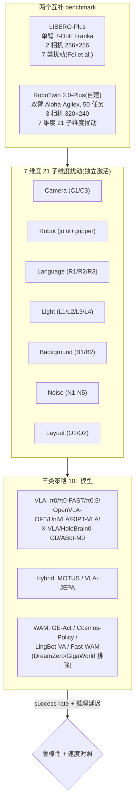
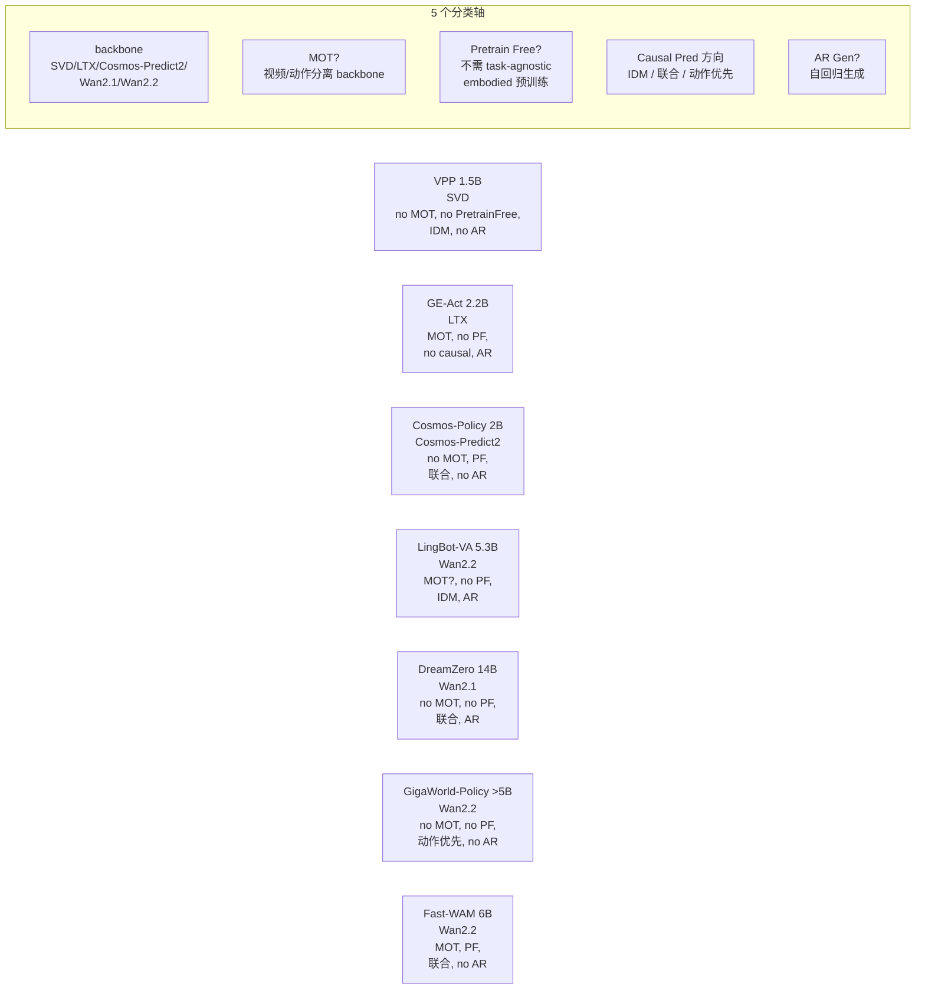
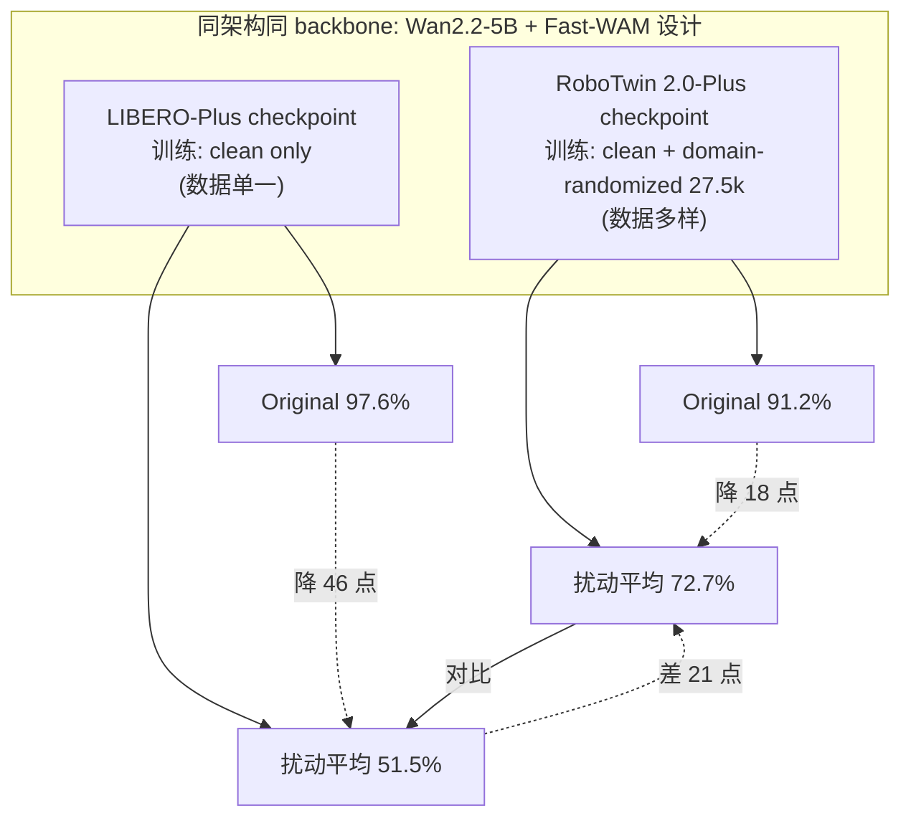

# WAM vs VLA 鲁棒性研究 — 架构详解

> 配套 `card.json`。本研究不提模型,而是评测既有 VLA/WAM 的鲁棒性。下面用 Mermaid 把评测框架、WAM 分类轴、Fast-WAM 天然实验三个核心结构画清,再用文字讲透。所有数字来自论文(页码/表号标注)。

## 1. 评测框架总览

**协议设计**:每 config 只激活一个扰动维度,其余保持 clean,50 episodes/task/config,8 configs/task(1 clean + 7 扰动分支)。这隔离每个维度的效果,避免混淆。同协议同硬件让 10+ 模型数字可比。

## 2. WAM 分类轴(Table 1)

**关键差异**:
- **Pretrain Free** 只有 Fast-WAM 是 ✓——它只用 task-specific 60h 数据无 embodied pre-training 就达 72.7%,证明视频 backbone 时空先验足够。
- **Causal Pred 方向** 三式:IDM 式(LingBot-VA/GE-Act 先预测状态再条件化动作)、联合去噪(Cosmos/DreamZero/Fast-WAM 共享 timestep)、动作优先(GigaWorld 先动作再条件化视频)。论文发现 IDM 式对训练数据多样性依赖更低。
- **测试时是否生成视频**:LingBot-VA/GE-Act/Cosmos 必须生成未来视觉状态再解码动作(慢);Fast-WAM/GigaWorld 可跳过视频生成直接出动作(快)。

## 3. Fast-WAM 天然实验:隔离"视频先验 vs 数据多样性"

这是本研究最有价值的发现,值得单独画。

**结论**:架构和 backbone 完全相同,唯一变量是训练数据多样性。RoboTwin(数据多样)只降 18 点;LIBERO(数据单一)降 46 点。**视频先验必要但不充分,task-specific 训练数据多样性仍是关键杠杆**。这把社区从"视频先验万能"的幻觉里拉回。

## 4. 三类策略的鲁棒性对照(RoboTwin 2.0-Plus 主结果)

| 类型 | 模型 | Original | Camera | Robot | Lang | Light | BG | Noise | Layout | Total |
|---|---|---|---|---|---|---|---|---|---|---|
| VLA | π0.5 | 78.4 | 45.6 | 27.6 | 74.4 | 49.6 | 71.7 | 64.9 | 56.8 | 58.6 |
| VLA | X-VLA | 65.6 | 23.2 | 65.2 | 64.4 | 63.1 | 58.6 | 49.7 | 34.8 | 53.1 |
| Hybrid | MOTUS | 87.0 | 21.6 | 85.0 | 83.2 | 84.6 | 84.4 | 43.1 | 82.8 | 71.5 |
| WAM | LingBot-VA | **92.1** | 28.9 | 36.2 | 87.3 | **89.0** | **91.3** | **80.9** | **87.9** | **74.2** |
| WAM | Fast-WAM | 91.2 | 30.4 | 53.2 | 86.7 | 88.8 | 90.0 | 76.4 | 83.2 | 72.7 |

**读法**:
- LingBot-VA 总分第一(74.2%),在 Light/Background/Noise/Layout 视觉扰动上最强(80.9~91.3%)。
- 但 Camera(28.9%)和 Robot(36.2%)是所有方法的硬伤——视频先验对几何配置改变帮助有限。
- π0.5 总分 58.6% 垫底,Light 才 49.6%——VLA 在视觉扰动上确实弱,但 Robot(27.6%)和 LingBot-VA(36.2%)差距没那么大,说明几何扰动对两类都难。
- MOTUS(混合)Robot 85.0% 最强,因为 action 走单独 VLM expert 对初始状态更鲁棒。

## 5. LIBERO-Plus 结果(单臂,VLA 反而更强)

| 类型 | 模型 | Original | Total |
|---|---|---|---|
| VLA | π0.5 | 96.9 | **85.7** |
| VLA | X-VLA | 98.1 | 71.4 |
| VLA | OpenVLA-OFT_m | 97.6 | 67.9 |
| Hybrid | VLA-JEPA | 97.2 | 77.9 |
| WAM | Cosmos-Policy | 98.5 | **82.2** |
| WAM | GE-Act | 94.4 | 80.3 |
| WAM | Fast-WAM(clean only) | 97.6 | 51.5 |

**关键反差**:LIBERO-Plus 上 π0.5(85.7%)反而超 WAM。原因:π0.5 训练数据极其多样(7 类混合:web data/multi-env tabletop/cross-embodiment/mobile manipulation/high-level planning/verbal instruction),用数据多样性补偿了视频先验缺失。WAM 省数据(省训练复杂度)但 LIBERO 上数据单一时 Fast-WAM 崩到 51.5%。

**两条路殊途同归到鲁棒**:WAM 靠视频先验省数据,VLA 靠数据多样性补先验缺失——都能到鲁棒,代价不同。

## 6. 推理延迟拆解(Table 5)

| 模型 | 类型 | Action chunk | 推理延迟 | vs π0.5 | state steps | action steps |
|---|---|---|---|---|---|---|
| π0.5 | VLA | 50 | 63 ms | 1.0× | — | — |
| X-VLA | VLA | 30 | 195 ms | 3.1× | — | — |
| Fast-WAM | WAM | 16 | 190 ms | 3.0× | (跳过) | — |
| GE-Act | WAM | 36 | 300 ms | 4.8× | 1 | 10 |
| Cosmos-Policy | WAM | 16 | 390 ms | 6.2× | 5 | 5 |
| LingBot-VA(RW) | WAM | 32 | 480 ms | 7.6× | 3 | 5 |
| MOTUS | Hybrid | 16 | 1175 ms | 18.6× | 10 | 10 |
| LingBot-VA(RT) | WAM | 32 | 5230 ms | 83× | 25 | 50 |

**发现**:
- WAM 全部至少 4.8× 慢于 π0.5(除 Fast-WAM 3.0×,但它跳过了 state 生成)。
- **state denoising steps 主导 runtime**:GE-Act 1 state step 最快(300ms),LingBot-VA(RT) 25 state steps 最慢(5230ms)。
- Fast-WAM 跳过测试时 state 生成是最快 WAM(190ms),但 LIBERO 数据单一时鲁棒性崩——速度和鲁棒性有 trade-off。

## 7. 评测协议数值 sense

| 项 | 值 | 出处 |
|---|---|---|
| benchmarks | 2:LIBERO-Plus(单臂 Franka,2 相机 256×256)+ RoboTwin 2.0-Plus(双臂 Aloha-Agilex,3 相机 320×240) | 论文 p7 |
| 任务 | RoboTwin 2.0-Plus: 50 双臂任务;LIBERO-Plus: 标准 LIBERO 任务集 | 论文 p7, App A |
| 扰动维度 | 7 维度 21 子维度:Camera(C1/C3 active,C2 default off)/Robot/Light(L1-L4)/Background(B1/B2)/Noise(N1-N5)/Layout(O1/O2)/Language(R1/R2/R3) | 论文 App A Table 6 |
| episodes | 50 episodes/task/config;8 configs/task(1 clean + 7 扰动分支) | 论文 App A.2 |
| Robot 扰动 | 关节 Gaussian noise std=0.1 rad(clip ±0.225 rad);gripper 极端位置(0.05/0.95) p=0.25 | 论文 App A.3 |
| Language 变体 | 2500 条预生成(50 任务×50 变体);R1 干扰~30%/R2 共识改写~50%/R3 推理链~20% | 论文 App A.3 |
| Noise(N1-N5) | motion blur/Gaussian blur/zoom blur/fog/glass blur;severity [2,3] | 论文 App A.3 Table 6 |
| Light(L1-L4) | diffuse color tint[0,3.5]/direction(35% side-light)/specular[0.3,6.0]/shadows | 论文 App A.3 |
| Camera(C1/C3) | distance[0.85,1.0]×/orientation yaw-pitch-roll[0,5°] | 论文 App A.3 |
| 模型参数跨度 | VPP 1.5B / GE-Act 2.2B / Cosmos-Policy 2B / LingBot-VA 5.3B / Fast-WAM 6B / DreamZero 14B;VLA 多 2-7B | 论文 Table 1 |
| action chunk | π0.5=50 / X-VLA=30 / Fast-WAM=GE-Act=Cosmos=MOTUS=16 / LingBot-VA=32 | 论文 Table 5 |
| π0.5 RoboTwin finetune | 27.5k 训练数据,60k steps,AdamW,cosine lr 2.5e-5→2.5e-6,batch 64,delta joint | 论文 p7 |

## 8. 三类策略的本质区别

| 维度 | VLA | Hybrid (VLA+WM) | WAM |
|---|---|---|---|
| backbone | VLM(静态图像-文本) | VLM + 视频辅助 | 视频扩散(动态视频) |
| 预训练先验 | 语义先验 | 语义 + 部分时空 | 完整时空先验 |
| 鲁棒性来源 | 数据多样性补偿 | 视频辅助任务注入 | 视频先验(必要不充分) |
| 训练复杂度 | 高(需多源数据) | 中 | 低(可 Pretrain Free) |
| 推理速度 | 快(63-195ms) | 慢(1175ms) | 慢(190-5230ms) |
| 代表 | π0.5, OpenVLA-OFT | MOTUS, VLA-JEPA | LingBot-VA, Fast-WAM, Cosmos |

**本研究的核心判断**:WAM 的定位是用视频先验换训练简单性,但付推理速度代价,并不必然比 VLA 强。VLA 用数据多样性也能到鲁棒,但训练复杂。两条路都能到鲁棒,选择取决于算力预算和数据可得性。
